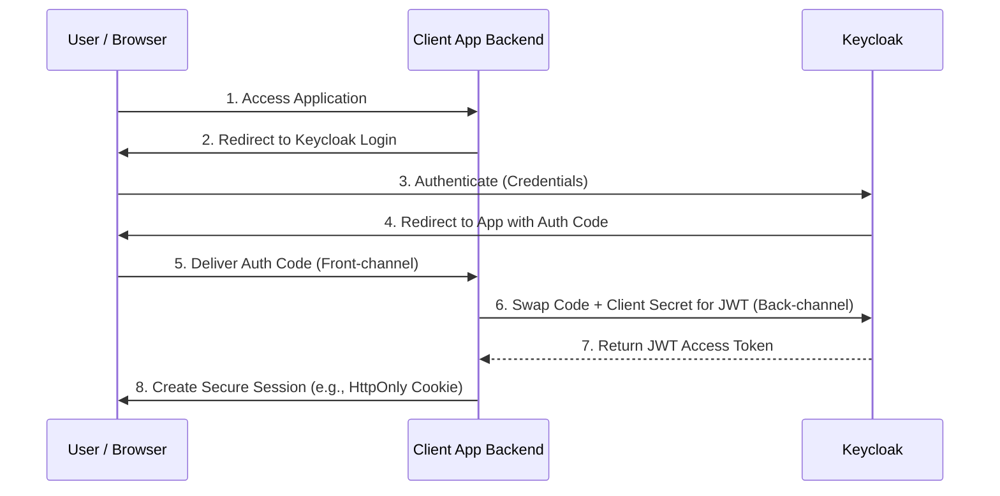
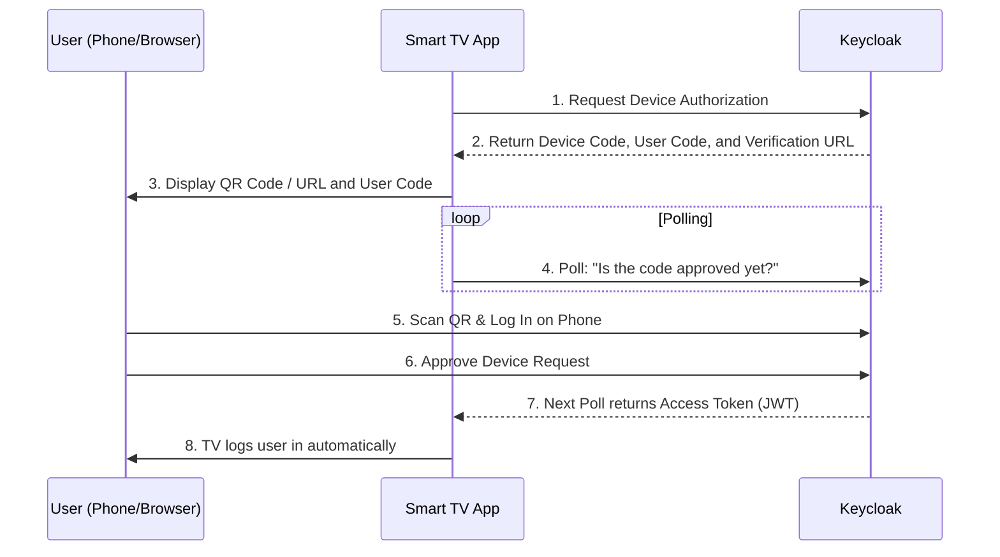
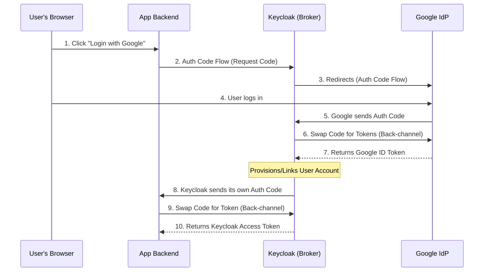

# Keycloak & OAuth 2.0 Concepts: Flow and Grant

This document is a comprehensive summary of the concepts, flows, and security architectures discussed regarding Keycloak, OAuth 2.0, and modern identity management.

---

## 1. OAuth Terminology: Flows vs. Grants

The easiest way to remember the distinction between these two often-confused terms:
* **The Flow (The Journey):** The entire sequence of events and redirects (e.g., user goes to a browser, app waits, code is swapped).
* **The Grant (The Receipt):** The specific piece of proof (the `grant_type` parameter) handed to the authorization server at the very end to get the token.

### Standard Flows & Grants Comparison

| The Scenario | The Flow (The Journey) | The Grant (`grant_type`) | How it works |
| :--- | :--- | :--- | :--- |
| **Standard Web Apps** | **Authorization Code Flow** | `authorization_code` | User logs in via browser. App gets a temporary code, trades it for a token. |
| **Machine to Machine** | **Client Credentials Flow** | `client_credentials` | No user involved. App sends its ID and secret directly to get a token. |
| **Smart TVs / CLI** | **Device Code Flow** | `urn:ietf:...:device_code` | App shows a code. User logs in on their phone. App polls until approved. |
| **Session Renewal** | **Refresh Token Flow** | `refresh_token` | Token expired. App sends refresh token to get a fresh access token. |

### Standard Authorization Code Flow

This is the primary flow used for standard web applications.

---

## 2. The Device Authorization Grant (Smart TV QR Codes)

Used for "input-constrained" devices (like TVs or CLI tools) where typing a secure password is not feasible.

1.  **Request:** TV asks Keycloak for login capability.
2.  **Codes Issued:** Keycloak returns a web link (`verification_uri`), a short user code, and a secret device code.
3.  **QR Generation:** The TV displays the web link as a QR code (often with the user code embedded).
4.  **Handoff:** The user scans the QR code and logs in securely on their smartphone.
5.  **Polling:** Meanwhile, the TV continuously polls Keycloak ("Are they done yet?").
6.  **Access Granted:** Once the phone finishes the login, Keycloak answers the TV's next poll with an access token.

---

## 3. Identity Brokering & Social Login

When a website allows "Login with Google/Facebook" but uses Keycloak internally, Keycloak acts as an **Identity Broker**. This utilizes a **Nested Authorization Code Flow**.

* **Crucial Detail:** The application *never* uses the Google token. Keycloak validates Google's proof, creates a local session, and issues its own Keycloak JWT to the application.

---

## 4. Security Architecture: Front-Channel vs. Back-Channel

Why don't we just send JWTs directly in URL redirects or POST payloads to the browser? Because the browser is a dangerous neighborhood.

* **Front-Channel (Untrusted/Public):** Anything passing through the browser (URLs, POST forms, JavaScript). Even over HTTPS, data is decrypted inside the browser and exposed to malicious extensions, Cross-Site Scripting (XSS), and local malware.
* **Back-Channel (Trusted/Private):** Direct server-to-server HTTPS connections that bypass the browser entirely.

### The "Claim Ticket" Concept
Instead of sending the sensitive JWT through the Front-Channel, OAuth sends an **Authorization Code**.
* The code is useless on its own. If stolen by a malicious browser extension, the attacker cannot use it.
* To redeem the code for a JWT, the application must make a Back-Channel request presenting a `client_secret` (a password known only to the backend server).

---

## 5. The SPA Problem and the BFF Pattern

If an application receives and holds a JWT directly inside the browser (like a traditional React or Vue Single Page Application), that JWT is vulnerable to XSS attacks.

### Path A: The Risky Way (Direct SPA)
* The browser receives the code and swaps it for a JWT.
* The JWT is stored in `localStorage` or memory.
* **Risk:** Malicious scripts (XSS) can easily read and steal the token.

### Path B: The Secure Way (BFF Pattern)
Modern OAuth 2.1 best practices require the **Backend-For-Frontend (BFF)** pattern for SPAs:
1.  A lightweight backend proxy (the BFF) handles the Authorization Code swap.
2.  The BFF stores the JWT securely in server memory.
3.  The BFF issues a secure, encrypted `HttpOnly` cookie to the browser.
4.  **Security:** `HttpOnly` cookies cannot be read by JavaScript. The browser never sees the JWT, completely neutralizing the risk of token theft via XSS.
