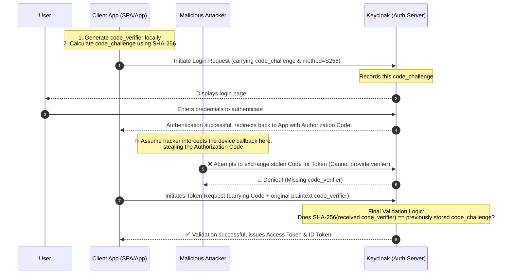

# OAuth 2.0 PKCE: Core Concepts and Validation Principles

## 1. What is PKCE?

**PKCE (Proof Key for Code Exchange)**, pronounced "pixy," is a core security extension protocol (RFC 7636) for the OAuth 2.0 Authorization Code Flow.

Its primary mission is: **To prove that the application initiating the login request and the application ultimately exchanging the authorization code for a Token are exactly the same, without relying on a `client_secret`, thereby preventing authorization code interception attacks.**

### Why is PKCE needed?
Pure frontend applications (SPAs, such as React/Vue) or mobile Apps are considered **Public Clients**. Because the code runs on the user's device, it is impossible to securely store a fixed `client_secret`.
Without the protection of a secret, if a hacker uses malware to listen to the callback URL on the device and intercepts the temporary `code` (authorization code), they could impersonate the legitimate application and exchange it for the user's Access Token at the server. PKCE was specifically invented to completely block this vulnerability.

---

## 2. Three Core Concepts of PKCE

1. **`code_verifier` (Dynamic Key)**
   - A high-strength, random string **generated locally** by the frontend application before initiating each login request.
   - This plaintext string is kept securely in the frontend (e.g., in memory) and **must absolutely never appear directly in the browser URL**.
2. **`code_challenge` (Encryption Lock)**
   - The value calculated by the frontend using a one-way hash (SHA-256) of the `code_verifier`.
   - It is secure because it is mathematically impossible to reverse-engineer the verifier from the challenge.
3. **`code_challenge_method` (Encryption Algorithm)**
   - Tells the authorization server the method used to generate the challenge. In modern standards, it is strongly recommended to exclusively use **`S256`** (SHA-256 with Base64URL encoding). *Never use `plain` (plaintext).*

---

## 3. PKCE Validation Flow Diagram

Here is the OAuth 2.0 Authorization Code flow with the PKCE extension:



---

## 4. Detailed Step-by-Step Breakdown

### Step 1: Prepare Encryption Parameters (Frontend Execution)
After the user clicks the "Login" button, the frontend system (or SDK) silently executes the following locally:
*   Generates `code_verifier`: `e3b0c44298fc1c149afbf4c8996fb92427ae41e4649b934ca495991b7852b855`
*   Calculates `code_challenge`: `Base64URL( SHA256( code_verifier ) )`

### Step 2: Initiate Authorization Request (Frontend -> Keycloak)
The frontend redirects the user to Keycloak's login endpoint `/auth` and appends the PKCE parameters to the URL:
```http
GET /realms/{realm}/protocol/openid-connect/auth
?client_id=my-spa-app
&response_type=code
&redirect_uri=https://myapp.com/callback
&code_challenge={generated_challenge_code}
&code_challenge_method=S256
```
*Upon receiving the request, Keycloak caches the `code_challenge` for this login session.*

### Step 3: Issue Authorization Code (Keycloak -> Frontend)
Upon successful user login, Keycloak issues a temporary authorization `code`.

### Step 4: Exchange for Token (Frontend -> Keycloak)
After receiving the `code`, the frontend sends a POST request to Keycloak's `/token` endpoint. **At this point, it must include the original `code_verifier`**.
```http
POST /realms/{realm}/protocol/openid-connect/token
Content-Type: application/x-www-form-urlencoded

grant_type=authorization_code
&client_id=my-spa-app
&redirect_uri=https://myapp.com/callback
&code={received_authorization_code}
&code_verifier={original_plaintext_verifier_from_step_1}
```

### Step 5: Server Final Validation (Keycloak Execution)
1. Keycloak receives the `code_verifier`.
2. Keycloak independently uses the `S256` algorithm to hash the received `code_verifier`.
3. Comparison: **Does the calculated result == the `code_challenge` stored in Step 2?**
4. If they match perfectly, it proves the client is legitimate, and JWT Tokens are issued. If they do not match or if the verifier is missing, the request is rejected (successfully defending against interception attacks).

---

## 5. Security Policy Configuration in Keycloak

When configuring Clients in Keycloak, the PKCE strategies are as follows:

### 1. Force PKCE (Best Practice)
For any SPA (React/Vue/Angular) or mobile application, it is highly recommended to forcefully enable PKCE in Keycloak:
*   **Path**: `Clients` -> Select specific client -> `Advanced` tab
*   **Configuration**: Set `Proof Key for Code Exchange Code Challenge Method` to **`S256`**.
*   **Effect**: If any application initiates a legacy request without a `code_challenge`, Keycloak will immediately reject it and return a `400 Bad Request` error.

### 2. Downgrade Attack Defense Mechanism (Default Behavior)
If this field is left empty (not forced) in Keycloak, Keycloak handles it intelligently:
*   As long as the client **proactively** includes a `code_challenge` in the first step, Keycloak will **forcefully lock PKCE** for this specific flow.
*   During the final Token exchange step, even if a hacker attempts to "play dumb" and omits the `code_verifier`, Keycloak will strictly reject it because a record exists from the first step. This effectively prevents hackers from attempting to downgrade the flow to a vulnerable mode without PKCE.
