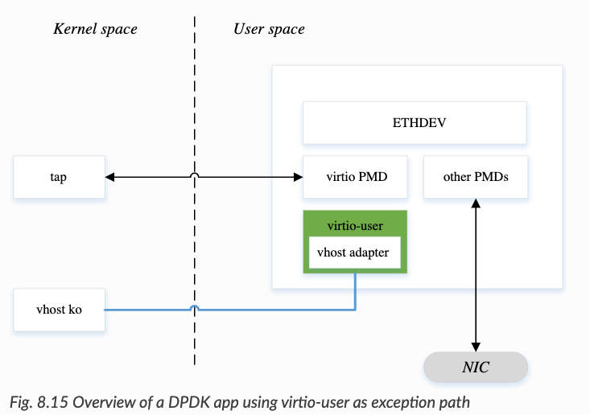

# DPDK

## Create PerformanceProfile CR

~~~bash

$ oc apply -f files/dpdk/pp.yaml

~~~

## Create SR-IOV Network Node Policy

~~~bash

$ oc apply -f sriov-network-node-policy.yaml # Pay attention for Intel NIC, in order to use DPDK, the deviceType needs to be vfio-pci

$ ip link show ens4f0

~~~

## Create SR-IOV Network or NAD

Create the NAD either through SriovNetwork CR or pure NAD CR

~~~bash

$ oc apply -f files/dpdk/dpdk-nad.yaml

# Or
# oc apply -f files/dpdk/dpdk-sriov-network.yaml

~~~

Check NAD CR has been created:

~~~bash

$ oc get net-attach-def -n dpdk-test

~~~

## Create TestPMD Pod

We specify `needVhostNet: true` in the sriovnetworknodepolicy CR, thus we could use the /dev/vhost-net driver as the backend. The virtio_user will implement a frontend to receive traffic and eventually a tap0 device will be created inside the dpdk Pod by using `--vdev=virtio_user0` option. Remember to get corresponding VF's MAC address and set it through `mac=` otherwise the traffic is not connected.

~~~bash

$ oc apply -f files/dpdk/dpdk-pod.yaml

$ oc rsh dpdk
sh-4.4# dpdk-testpmd -n 4 -l `cat /sys/fs/cgroup/cpuset/cpuset.cpus` -a $PCIDEVICE_OPENSHIFT_IO_SRIOV_DPDK_ENS4F0 --socket-mem 1024 --vdev=virtio_user0,path=/dev/vhost-net,mac="1a:27:87:e3:6f:84"
EAL: Detected CPU lcores: 64
EAL: Detected NUMA nodes: 2
EAL: Detected shared linkage of DPDK
EAL: Multi-process socket /var/run/dpdk/rte/mp_socket
EAL: Selected IOVA mode 'VA'
EAL: No available 2048 kB hugepages reported
EAL: VFIO support initialized
EAL: Using IOMMU type 1 (Type 1)
EAL: Probe PCI driver: net_iavf (8086:1889) device: 0000:b1:07.2 (socket 1)
TELEMETRY: No legacy callbacks, legacy socket not created
Warning: NUMA should be configured manually by using --port-numa-config and --ring-numa-config parameters along with --numa.
testpmd: create a new mbuf pool <mb_pool_1>: n=171456, size=2176, socket=1
testpmd: preferred mempool ops selected: ring_mp_mc
Configuring Port 0 (socket 1)
iavf_configure_queues(): request RXDID[22] in Queue[0]

Port 0: link state change event

Port 0: link state change event
Port 0: 1A:27:87:E3:6F:84
Configuring Port 1 (socket 1)
Port 1: 1A:27:87:E3:6F:84
Checking link statuses...
Done
Error during enabling promiscuous mode for port 1: Operation not supported - ignore
No commandline core given, start packet forwarding
io packet forwarding - ports=2 - cores=1 - streams=2 - NUMA support enabled, MP allocation mode: native
Logical Core 11 (socket 1) forwards packets on 2 streams:
  RX P=0/Q=0 (socket 1) -> TX P=1/Q=0 (socket 1) peer=02:00:00:00:00:01
  RX P=1/Q=0 (socket 1) -> TX P=0/Q=0 (socket 1) peer=02:00:00:00:00:00

  io packet forwarding packets/burst=32
  nb forwarding cores=1 - nb forwarding ports=2
  port 0: RX queue number: 1 Tx queue number: 1
    Rx offloads=0x0 Tx offloads=0x10000
    RX queue: 0
      RX desc=512 - RX free threshold=32
      RX threshold registers: pthresh=0 hthresh=0  wthresh=0
      RX Offloads=0x0
    TX queue: 0
      TX desc=512 - TX free threshold=32
      TX threshold registers: pthresh=0 hthresh=0  wthresh=0
      TX offloads=0x10000 - TX RS bit threshold=32
  port 1: RX queue number: 1 Tx queue number: 1
    Rx offloads=0x0 Tx offloads=0x0
    RX queue: 0
      RX desc=0 - RX free threshold=0
      RX threshold registers: pthresh=0 hthresh=0  wthresh=0
      RX Offloads=0x0
    TX queue: 0
      TX desc=0 - TX free threshold=0
      TX threshold registers: pthresh=0 hthresh=0  wthresh=0
      TX offloads=0x0 - TX RS bit threshold=0
Press enter to exit

~~~

## Test tap0 is Pingable through VLAN

We spanwed another SR-IOV Pod, whose VF is in the same PF of dpdk. We configured vlan 545 for two Pods and see whether they are connected when `promisc` is off and `spoofchk` is on for VF.

~~~bash

$ cat configure.sh
pod1=sriovpod1
pod2=dpdk
ip1=192.168.1.11/24
ip2=192.168.1.22/24

oc exec -it $pod1 -- ip link add link test2 name f1 type vlan id 545
oc exec -it $pod1 -- ip link set test2 up
oc exec -it $pod1 -- ip link set f1 up
oc exec -it $pod1 -- ip link set test2 mtu 1500
oc exec -it $pod1 -- ip link set f1 mtu 1500
oc exec -it $pod1 -- ip addr add $ip1 dev f1

oc exec -it $pod2 -- ip link add link tap0 name f1 type vlan id 545
oc exec -it $pod2 -- ip link set tap0 up
oc exec -it $pod2 -- ip link set tap0 mtu 1500
oc exec -it $pod2 -- ip link set f1 up
oc exec -it $pod2 -- ip link set f1 mtu 1500
oc exec -it $pod2 -- ip addr add $ip2 dev f1

sleep 2

oc exec -it $pod1 -- ping -W1 -c 5 `echo $ip2 | cut -d/ -f1`
~~~

Run the Test:

~~~bash

$ bash -x configure.sh
+ pod1=sriovpod1
+ pod2=dpdk
+ ip1=192.168.1.11/24
+ ip2=192.168.1.22/24
+ oc exec -it sriovpod1 -- ip link add link test2 name f1 type vlan id 545
+ oc exec -it sriovpod1 -- ip link set test2 up
+ oc exec -it sriovpod1 -- ip link set f1 up
+ oc exec -it sriovpod1 -- ip link set test2 mtu 1500
+ oc exec -it sriovpod1 -- ip link set f1 mtu 1500
+ oc exec -it sriovpod1 -- ip addr add 192.168.1.11/24 dev f1
+ oc exec -it dpdk -- ip link add link tap0 name f1 type vlan id 545
+ oc exec -it dpdk -- ip link set tap0 up
+ oc exec -it dpdk -- ip link set tap0 mtu 1500
+ oc exec -it dpdk -- ip link set f1 up
+ oc exec -it dpdk -- ip link set f1 mtu 1500
+ oc exec -it dpdk -- ip addr add 192.168.1.22/24 dev f1
+ sleep 2
++ echo 192.168.1.22/24
++ cut -d/ -f1
+ oc exec -it sriovpod1 -- ping -W1 -c 5 192.168.1.22
PING 192.168.1.22 (192.168.1.22) 56(84) bytes of data.
64 bytes from 192.168.1.22: icmp_seq=1 ttl=64 time=0.101 ms
64 bytes from 192.168.1.22: icmp_seq=2 ttl=64 time=0.042 ms
64 bytes from 192.168.1.22: icmp_seq=3 ttl=64 time=0.047 ms
64 bytes from 192.168.1.22: icmp_seq=4 ttl=64 time=0.049 ms
64 bytes from 192.168.1.22: icmp_seq=5 ttl=64 time=0.045 ms

--- 192.168.1.22 ping statistics ---
5 packets transmitted, 5 received, 0% packet loss, time 4076ms
rtt min/avg/max/mdev = 0.042/0.056/0.101/0.024 ms

~~~
