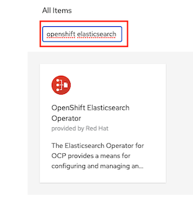
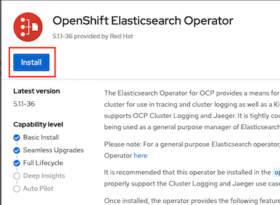
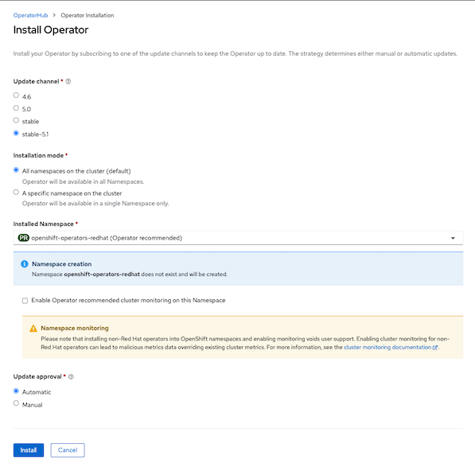
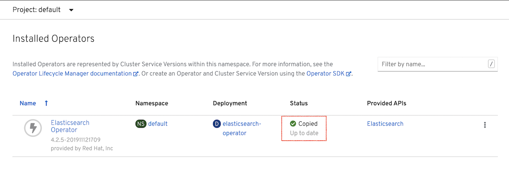
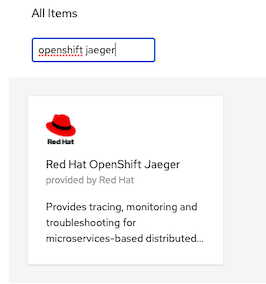
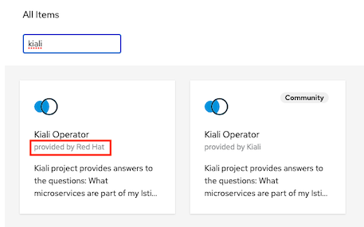
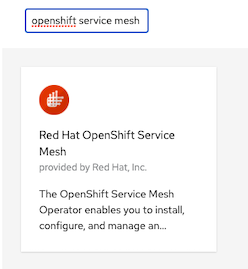
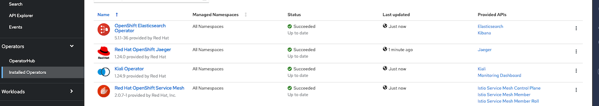

# Red Hat OpenShift Service Mesh Installation Lab

Use the Red Hat OpenShift Service Mesh operator to deploy a multi-tenant Service Mesh

<!-- TOC -->

- [Red Hat OpenShift Service Mesh Installation Lab](#red-hat-openshift-service-mesh-installation-lab)
  - [Setup](#setup)
  - [Install Operators](#install-operators)
  - [Next Topic](#next-topic)

<!-- /TOC -->

## Setup

Installing the OpenShift Service Mesh involves :

* Install Elasticsearch Operator
* Intall Jaeger Operator
* Install Kiali Operator
* Installing the Service Mesh Operator

## Install Operators

**Remark: Instructor already installed all operators for you. This is per cluster activities by Cluster Administrator**

Login to OpenShift Web Console using Adimin user
* In the OCP Web Console, navigate to: Catalog -> Operator Hub
* In the OperatorHub catalog of your OCP Web Console, type Elasticsearch into the filter box to locate the Elasticsearch Operator (by Red Hat)
  
  

* Click the Elasticsearch Operator to display information about the Operator and Click Install
  
  

* On the Create Operator Subscription page. Select All namespaces on the cluster (default). This installs the Operator in the default openshift-operators project and makes the Operator available to all projects in the cluster and Click Subscribe. 
  
  

  Remark: This is for demo purpose then in your enviroment, consider to set Update Approval to *manual*
<!-- * The Subscription Overview page displays the Elasticsearch Operator’s installation progress. Following screen show Elasticsearch oprator installed.
      -->
* Repeat all steps for Jaeger, Kiali and OpenShift Service Mesh. **Select Operator that provided by Red Hat not Community version.**
  -  Jaeger Operator
  
     

  -  Kiali Operator
  
     

  -  OpenShift Service Mesh Operator
  
     

* Navigate to Operators->Installed Operators and verify that 4 operators alrady installed.
  
     

## Next Topic
[Configure Service Mesh Control Plane](./01-install-service-mesh.md)