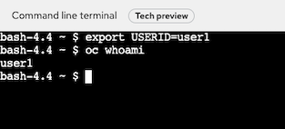

# Red Hat OpenShift Service Mesh Control Plane Lab

Use the Red Hat OpenShift Service Mesh operator to deploy a multi-tenant Service Mesh

<!-- TOC -->

- [Red Hat OpenShift Service Mesh Control Plane Lab](#red-hat-openshift-service-mesh-control-plane-lab)
  - [Control Plan and Members Roll Configuration](#control-plan-and-members-roll-configuration)
  - [Setup](#setup)
  - [Create Service Mesh Control Plane](#create-service-mesh-control-plane)
  - [Service Mesh Member Roll](#service-mesh-member-roll)
  - [Network Policy](#network-policy)
  - [Next Topic](#next-topic)

<!-- /TOC -->

## Control Plan and Members Roll Configuration

Configure Control Plane including

* Configure Control Plane
* Configure project(s) or namespace(s) to be part of Service Mesh
  
Overall steps including
* Create project for ControlPlane. Normally named istio-system.
  *Remark: For this lab will be ${USERID}-istio-system*
* Creating and managing a ServiceMeshControlPlane resource to deploy the Service Mesh control plane
* Creating a ServiceMeshMemberRoll resource to specify the namespaces associated with the Service Mesh.

Following command line tools will be used in labs

* OpenShift Command Line Interface (CLI - oc command) 
* cURLs
* git (optional)
  
<!-- OpenShift Web Console provided link in the top right of page to download oc command here.


You can  also  download oc tool and cURL for OSX and Windows here => [Link](https://1drv.ms/u/s!ArOxOqm_sB7DiSYninA0Aqd6a-kU?e=zsJMGn) -->

## Setup

<!-- ### Lab Configuration -->

<!-- * Setup environment variables
```bash
export USERID=<your user ID> 
```

* For Windows
```bash
set USERID=<your user ID>
```

* Login to OpenShift with oc command by
```bash
oc login --insecure-skip-tls-verify=true --username=$USERID --server=<URL to OpenShift API> --username=${USERID} --password=<password>
```

* For Windows
```bash
oc login --username=%USERID% --server=<URL to OpenShift API> 
```

* Use your browser to open OpenShift Web Admin Console and login with your User ID. To display console URL
```bash
oc whoami --show-console
``` -->

<!-- ### Labs Content -->

<!-- * Clone labs content to your working directory. Open your terminal (For OSX terminal, iTerm2, etc and CMD for Windows) then run following command
* Link to lab repository [Service Mesh Workshop](https://gitlab.com/workshop6/service-mesh)

```bash
git clone https://gitlab.com/workshop6/service-mesh.git
```

If you don't have git, click this Link =>[Service Mesh Workshop](https://gitlab.com/workshop6/service-mesh) -->

<!-- 
* Download labs content by click following icon.

 -->

<!-- ### Projects for Control Plane and Demo Apps -->

* OpenShift Web Console and login with your user ID (userX) and password
  - Create Project by select new project from top-left menu then create your project
    **Remark: replace user1 with your user ID**

  - Control Plane

    

  - Demo applications

    

  - Load Test
    
    
  
  - Use OpenShift Web Terminal
    - Open Web Terminal from icon > on the menu bar
      
      

    - Select project $USERID-load-test
      
      

    - Set USERID environment variable
      
      ```bash
      export USERID=<your user ID>
      oc whoami
      ```

      

    - Clone labs content to your working directory. Open your terminal (For OSX terminal, iTerm2, etc and CMD for Windows) then run following command
      
      ```bash
      git clone https://gitlab.com/workshop6/service-mesh.git
      cd service-mesh
      ```

      
      
    - For your convenience, You can open web terminal to another tab and also can minimize it with icon on top right of web terminal window.

* [Optional] Command Line. If you have oc CLI on your laptop, you can crate projects with following command.
  - Create projects (namespace) for Service Mesh's control plane and your applications.

    ```bash
    export USERID=<your user ID>
    oc new-project $USERID-istio-system --display-name="$USERID Istio System"
    oc new-project $USERID-load-test --display-name="Load Test"  --description="Load Test and Web Terminal"
    oc new-project $USERID
    ```
    Or run following bash script
    
    ```bash
    export USERID=<your user ID>
    scripts/create-project.sh
    ```
## Create Service Mesh Control Plane

Now that the Service Mesh Operator has been installed, you can now install a Service Mesh control plane.
The previously installed Service Mesh operator watches for a ServiceMeshControlPlane resource in all namespaces. Based on the configurations defined in that ServiceMeshControlPlane, the operator creates the Service Mesh control plane.

In this section of the lab, you define a ServiceMeshControlPlane and apply it to your **$USERID-istio-system namespace**.
  
* Web Console 
  - Switch to Adminstration and navigate to: Operators -> Installed Operators then select Red Hat OpenShift Service Mesh->Service Mesh Control Plane

  

  - Select Create *ServiceMeshControlPlane*

  

  - Navigate to Proxy and input following values to enable access log at Envoy (sidecar)

  

  - Click Create

  

  - Navigate to Workloads -> Pods to verify that pods are creating.
  
  


* Command Line
  - Install Control Plane using the custom resource file [basic install](../install/basic-install.yaml)
  - Create the service mesh control plane in the istio-system project from [basic-install.yaml](../install/basic-install.yml) by create Service Mesh's CRDs to control plane project.
  
    ```bash
    oc apply -f install/basic-install.yaml -n $USERID-istio-system
    ```
    
    Or use following bash script
    
    ```bash
    scripts/create-control-plane.sh
    ```
* Check the progress of deployment
  
  ```bash
  oc get pods -n $USERID-istio-system
  ```
  
  Sample output show deployment is on progress
  
  ```bash
  NAME                                    READY   STATUS              RESTARTS   AGE
  grafana-64c8578d64-msvxl                0/2     ContainerCreating   0          2s
  istio-egressgateway-5b4b45f9bd-6rn45    0/1     ContainerCreating   0          2s
  istio-ingressgateway-6c6f677b95-tpgsp   0/1     ContainerCreating   0          2s
  istiod-basic-b99d85746-n56sc            1/1     Running             0          22s
  jaeger-d79d845d9-4hlv7                  0/2     ContainerCreating   0          2s
  prometheus-6f784bd948-wq2ms             3/3     Running             0          11s
  ```  

  The entire installation process can take approximately 2-5 minutes. Confirm that following pods are up and running

* Verify control plane installation

  ```bash
  watch oc get smcp -n ${USERID}-istio-system
  ```

  Sample output
  
  ```bash
  NAME    READY   STATUS            PROFILES      VERSION   AGE
  basic   9/9     ComponentsReady   ["default"]   2.0.7.1   2m39s
  ```


## Service Mesh Member Roll

The Service Mesh operator has installed a control plane configured for multitenancy. This installation reduces the scope of the control plane to only those projects/namespaces listed in a ServiceMeshMemberRoll.

In this section of the lab, you create a ServiceMeshMemberRoll resource with the project/namespaces you wish to be part of the mesh. This ServiceMeshMemberRoll is required to be named default and exist in the same namespace where the ServiceMeshControlPlane resource resides (ie: $USERID-istio-system).

* By Web Console
  - Select Project: $USERID-istio-system
  - Operators->Installed Operators
  - Select *Red Hat OpenShift Service Mesh*
  - Select Create Instance under *Istio Service Mesh Member Roll*

    

  - Select YAML view-> Change members to $USERID and click Create
    
    

* By Web Console
  - Check [Service Mesh Member Roll YAML](../install/memberroll.yaml)
    
    ```yaml
    apiVersion: maistra.io/v1
    kind: ServiceMeshMemberRoll
    metadata:
      name: default
    spec:
      members:
      - userX
    ```

  - Run following command to replace userX with your project and create this CRD.
    
    ```bash
    cat install/memberroll.yaml| sed s/userX/$USERID/ | oc create -n $USERID-istio-system -f -
    ```

* Verify status of member roll

  ```bash
  oc get smmr -n $USERID-istio-system
  ```

  Sample output

  ```bash
  NAME      READY   STATUS       AGE
  default   1/1     Configured   6s
  ```

## Network Policy
* Check network policy **istio-expose-route**

  ```bash
  oc get networkpolicy/istio-expose-route-basic -o yaml -n $USERID
  ```

  Incoming traffic to this namespace from **Ingress** will be allow only pod labelled with **maistra.io/expose-route: "true"**

  ```yaml
  spec:
    ingress:
    - from:
      - namespaceSelector:
          matchLabels:
            network.openshift.io/policy-group: ingress
    podSelector:
      matchLabels:
        maistra.io/expose-route: "true"
  ```
<!-- By Web Console, navigate to: Operators -> Installed Operators then select Red Hat OpenShift Service Mesh and Select Create Instance under Istio Service Member Roll
Change member to your User ID (:ie user1) then select Create


Verify that member roll is created

 -->

## Next Topic

[MicroService Application Deployment](./02-microservice-deployment.md)