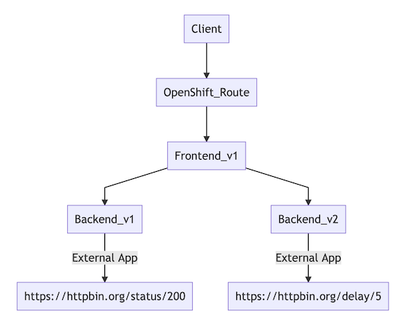
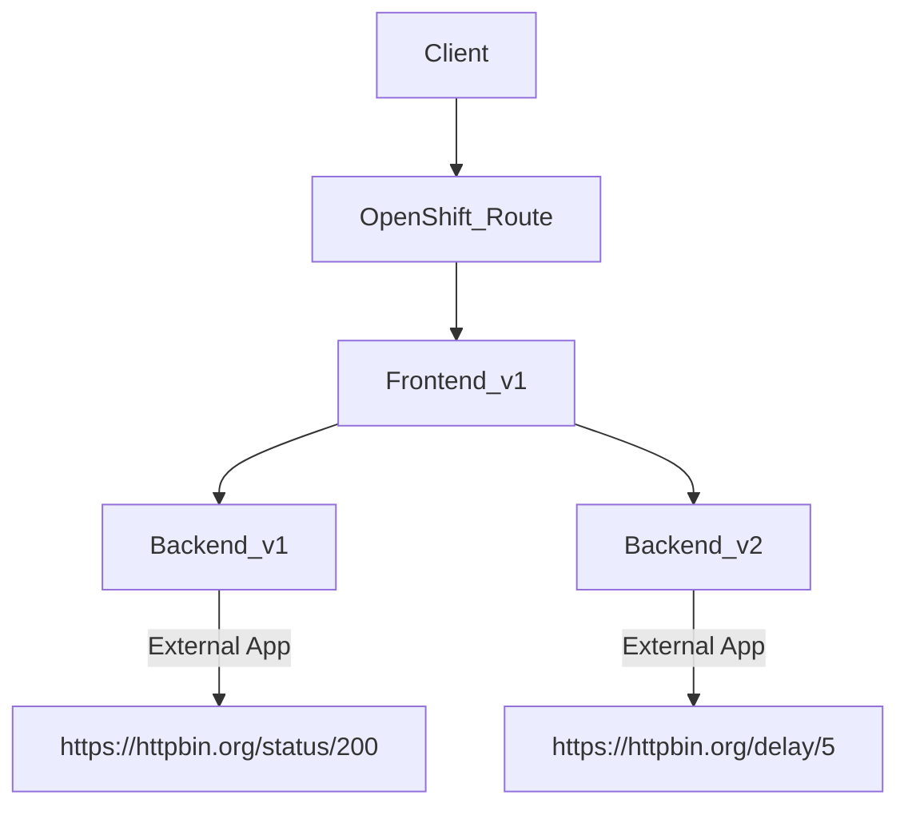
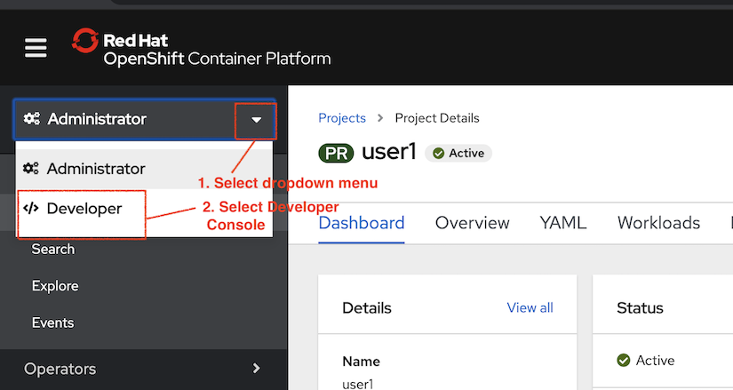
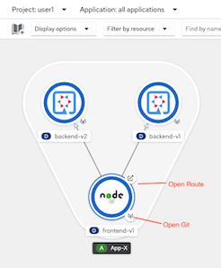
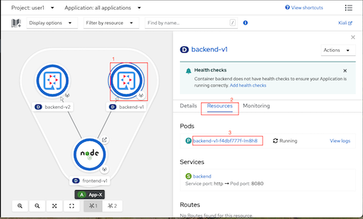
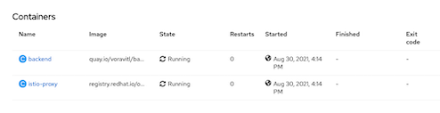
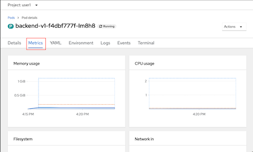
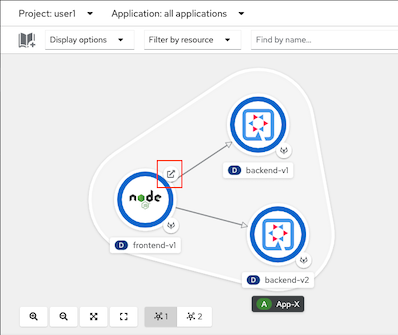

# Microservices Deployment Lab

<!-- TOC -->

- [Microservices Deployment Lab](#microservices-deployment-lab)
  - [Frontend and Backend app](#frontend-and-backend-app)
  - [Deploy Frontend and Backend app](#deploy-frontend-and-backend-app)
    - [Deploy Applications](#deploy-applications)
    - [OpenShift Developer Console](#openshift-developer-console)
    - [Test Appliation](#test-appliation)
      - [Network Policy](#network-policy)
  - [Next Topic](#next-topic)

<!-- /TOC -->

## Frontend and Backend app

There are two microservices in this lab that you will deploy to OpenShift. In a later lab of this course, you will manage the interactions between these microservices using Red Hat OpenShift Service Mesh.

<!--  -->


* Deploy microservices applications to OpenShift Container Platform 
* Observe how to automatic injection of Service Mesh sidecar into each microservice


## Deploy Frontend and Backend app
You start by deploying the catalog service to OpenShift. The sidecar proxy is automatically injected by annotated pod with 

```yaml
sidecar.istio.io/inject: "true"
```

Check for annotation section in [deployment of backend v1](../ocp/backend-v1-deployment.yml) and [deployment of backend v2](../ocp/backend-v2-deployment.yml)

```yaml
spec:
  replicas: 1
  template:
    metadata:
      labels:
        app: backend
        version: v1
      annotations:
        sidecar.istio.io/inject: "true"
```

<!-- Check for annotation section in [deployment of frontend v1](../ocp/frontend-v1-deployment.yml) and [deployment of backend v2](../ocp/frontend-v2-deployment.yml)

```yaml
template:
    metadata:
      labels:
        app: frontend
        version: v1
        maistra.io/expose-route: 'true' -->
```

Check for annotation section in [deployment of frontend v1](../ocp/frontend-v1-deployment.yml) that there is no **sidecar.istio.io/inject: "true"** in deployment file.

You can annotate existing deployment with oc patch command

```bash
oc patch deployment/frontend-v1 -p '{"spec":{"template":{"metadata":{"annotations":{"sidecar.istio.io/inject":"true"}}}}}' -n $USERID
```
Review configuration of backend v1 and v2. 
* Backend v1 is configured to call https://httpbin.org/status/200 
  ```yaml
        env:
          - name: app.backend
            value: https://httpbin.org/status/200
  ```
* Backend v2 is configured to call https://httpbin.org/delay/5. This will caused Backend v2 delay 5 sec to respose back to Frontend
  ```yaml
        env:
          - name: app.backend
            value: https://httpbin.org/delay/5 
  ```

### Deploy Applications

```bash
oc apply -f ocp/frontend-v1-deployment.yaml -n $USERID
oc apply -f ocp/frontend-service.yaml -n $USERID
oc apply -f ocp/frontend-route.yaml -n $USERID
oc patch deployment/frontend-v1 -p '{"spec":{"template":{"metadata":{"annotations":{"sidecar.istio.io/inject":"true"}}}}}' -n $USERID
oc apply -f ocp/backend-v1-deployment.yaml -n $USERID
oc apply -f ocp/backend-v2-deployment.yaml -n $USERID
oc apply -f ocp/backend-service.yaml -n $USERID
```

or run bash script [deploy.sh](../scripts/deploy.sh)

```bash
scripts/deploy.sh
```

Sample outout

```bash
deployment.extensions/frontend created
service/frontend created
route.route.openshift.io/frontend created
deployment.extensions/backend-v1 created
deployment.extensions/backend-v2 created
service/backend created
```

Monitor the deployment of the pods:

```bash
watch oc get pods -n $USERID
```

Example of output

```bash
NAME                           READY   STATUS    RESTARTS   AGE
backend-v1-f4dbf777f-lm8h8     2/2     Running   0          2m26s
backend-v2-668bc66875-vkjxk    2/2     Running   0          2m20s
frontend-v1-677b9c7d9c-g9hk9   2/2     Running   0          2m28s
```

Wait until the Ready column displays 2/2 pods and the Status column displays Running:
Press Control-C to exit.

### OpenShift Developer Console

Login to OpenShift Web Console. Then select Developer Console and select menu Topology



Both Frontend and Backend app are shown as follow



Check for backend pod memory and cpu usage by click on donut, select tab resources and then select pod



Scroll down to container section that backend pod consists of 2 containers



Select tab Metrics CPU and memory usage of backend pod show as follow




### Test Appliation
Test frontend app by

```bash
export FRONTEND_URL=http://$(oc get route frontend -n $USERID -o jsonpath='{.status.ingress[0].host}')
```

You can also use [get-urls.sh](../scripts/get-urls.sh) for display and set environment variables for all URLs used through out labs

```bash
source scripts/get-urls.sh
```

You can also get Frontend Route from Developer Console



Test frontend application with cURL

```bash
curl -v $FRONTEND_URL
```
You will get following error
```bash
> GET / HTTP/1.1
> Host: frontend-user1.apps.cluster-f25e.f25e.sandbox1804.opentlc.com
> User-Agent: curl/7.64.1
> Accept: */*
>
* HTTP 1.0, assume close after body
< HTTP/1.0 503 Service Unavailable
< pragma: no-cache
< cache-control: private, max-age=0, no-cache, no-store
< content-type: text/html
<
```
This happened because of network policies added by OpenShfit Service Mesh

#### Network Policy
When you join project/namespace to control plane following network policies will be automatically added.

```bash
oc get networkpolicy -n $USERID
```

Example of output

```bash
NAME                       POD-SELECTOR                   AGE
istio-expose-route-basic   maistra.io/expose-route=true   38m
istio-mesh-basic           <none>                         38m
```

Check network policy **istio-expose-route**
```bash
oc get networkpolicy/istio-expose-route-basic -n $USERID -o yaml
```

**istio-expose-route** network policy
```yaml
spec:
  ingress:
  - from:
    - namespaceSelector:
        matchLabels:
          network.openshift.io/policy-group: ingress
  podSelector:
    matchLabels:
      maistra.io/expose-route: "true"
  policyTypes:
  - Ingress
```
This means that pod will accept incoming request from default OpenShift's route only that pod has label maistra.io/expose-route equals to true. 

Then you need to add this label to frontend deployment.

```bash
oc patch deployment/frontend-v1 -p '{"spec":{"template":{"metadata":{"labels":{"maistra.io/expose-route":"true"}}}}}' -n $USERID
```

Wait unit frontend pod is running then test with cURL again.

```bash
curl $FRONTEND_URL
```

Sample outout

```bash
Frontend version: 1.0.0 => [Backend: http://backend:8080, Response: 200, Body: Backend version:v1, Response:200, Host:backend-v1-f4dbf777f-5bnzb, Status:200, Message: Hello, Quarkus]
```

Explain result:

- Frontend version v1 call Backend service (with URL http://backend:8080)
- Response code is 200
- Response from Backend are
- version is v1
- pod backend-v1-f4dbf777f-5bnzb
- Response message from Backend is Hello World!!

Verify that [backend-service.yaml](../ocp/backend-service.yaml) is set to just app label. This will included both backend v1 in v2 into this backend service. By default backend service will load balanced all backend pods with round robin algorithm.

```yaml
  selector:
    app: backend
```

Try to run cURL command again and check that response from backend will round-robin between v1 and v2 and v2 is elapsed time is slightly more than 5 sec.


You also can use following cURL for check response time

```bash
curl $FRONTEND_URL -s -w "\nElapsed Time:%{time_total}\n" | grep Elapsed
curl $FRONTEND_URL -s -w "\nElapsed Time:%{time_total}\n" | grep Elapsed
```

Sample output

```bash
Elapsed Time:0.585137
Elapsed Time:5.573825
```

## Next Topic
[Observability with Kiali and Jaeger](./03-observability.md)