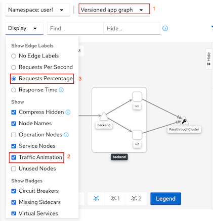

# Service Mesh Monitoring with Kiali Lab

Monitor your Istio service mesh with Kiali

<!-- TOC -->

- [Service Mesh Monitoring with Kiali Lab](#service-mesh-monitoring-with-kiali-lab)
  - [Review Service Mesh Monitoring](#review-service-mesh-monitoring)
  - [Explore Kiali](#explore-kiali)
  - [Using Kiali](#using-kiali)
    - [View Service Graph](#view-service-graph)
    - [Explore Services & Workloads](#explore-services--workloads)
    - [Distributed Tracing](#distributed-tracing)
  - [Next Topic](#next-topic)

<!-- /TOC -->

## Review Service Mesh Monitoring

At some point when you are developing your microservices architecture, you may want to visualize what is happening in your service mesh. You may have questions like “Which service is connected to which other service?” and “How much traffic goes to each microservice?” But because of the loosely tied nature of microservices architectures, these questions can be difficult to answer.

Those are the kinds of question that Kiali has the ability to answer—by giving you a big picture of the mesh and showing the whole flow of your requests and data.


## Explore Kiali

Kiali taps into the data provided by Istio and OpenShift® Container Platform to generate its visualizations. It fetches ingress data (such as request tracing with Jaeger), the listing and data of the services, health indexes, and so on.

Kiali runs as a service together with Istio, and does not require any changes to Istio or OpenShift Container Platform configuration (besides the ones required to install Istio).

Get the URL of the Kiali web console and set as an environment variable:

```bash
export KIALI_URL=https://$(oc get route kiali -n $USERID-istio-system -o template --template='{{.spec.host}}')
echo $KIALI_URL
```

You can also get URL to access Kiali from Developer Console.


Kiali Login screen


## Using Kiali


### View Service Graph

* Click Overview Menu to see overall project managed by control plane.

  

* Select the Graph from left menu
  - Select version graph
  - Enable animation by select Display -> and enable checkbox Traffic Animation
  - Set Kiali to display request percentage
  
  

* To show the capabilities of Kiali Graph, you need to generate some sample data. 
  - Use K6 load test tool
    - Create new project for K6 load test tool
      
      ```bash
      oc new-project $USERID-load-test
      ```

    - Run load test with K6 
      
      ```bash
      FRONTEND_URL=http://$(oc get route frontend -n $USERID -o jsonpath='{.spec.host}')
      oc run load-test -n $USERID-load-test -i --rm \
      --image=loadimpact/k6 --rm=true --restart=Never \
      --  run -  < scripts/load-test-k6.js \
      -e URL=$FRONTEND_URL -e THREADS=3 -e DURATION=2m -e RAMPUP=2s -e RAMPDOWN=0s
      ```
  - Run bash scripts to loop request to frontend app for 50 times
    
    ```bash
    scripts/run-50.sh
    ```
    
    Sample output

    ```bash
    Backend:v1, Response Code: 200, Host:backend-v1-f4dbf777f-lm8h8, Elapsed Time:0.547946 sec
    Backend:v2, Response Code: 504, Host:backend-v2-7cf5cd78db-v7klv, Elapsed Time:0.563757 sec
    Backend:v1, Response Code: 200, Host:backend-v1-f4dbf777f-lm8h8, Elapsed Time:0.593897 sec
    Backend:v2, Response Code: 504, Host:backend-v2-7cf5cd78db-v7klv, Elapsed Time:0.616969 sec
    ========================================================
    Total Request: 50
    Version v1: 26
    Version v2: 24
    ========================================================
    ```

* Check Kiali Console Graph. On the right of the screen show the result HTTP Response Code (OK, 3xx, 4xx, 5xx)

  

* Change Display to Response Time and re-run K6 again
  
  

* Set backend-v2 to response with HTTP error response code
  - Developer Console->Select backend-v2->Resources->Select Pod
  - Click Terminal then run following command
    
    ```bash
    curl http://localhost:8080/stop
    ```
    
    Example screen
    
    

  - Verify that backend-v2 will return with response code 504
    
    ```bash
    curl -v http://localhost:8080/
    ```
  
  - Run K6 again and check Kiali Graph. Notice response code on bottom right of the screen.
    
    

  - Set backend-v2 to return with HTTP code 503

    ```bash
    curl http://localhost:8080/start
    curl http://localhost:8080/not_ready
    curl -v http://localhost:8080
    ```
  - Run [run-50.sh](../scripts/run-50.sh). This time all responses will be returned from backend-v1. *Envoy automatically detect response 503 and retry with another pod.*
  
    ```bash
    scripts/run-50.sh
    ```

    Sample output

    ```bash
    Backend:v1, Response Code: 200, Host:backend-v1-f4dbf777f-lm8h8, Elapsed Time:0.546767 sec
    Backend:v1, Response Code: 200, Host:backend-v1-f4dbf777f-lm8h8, Elapsed Time:0.567982 sec
    Backend:v1, Response Code: 200, Host:backend-v1-f4dbf777f-lm8h8, Elapsed Time:0.549306 sec
    Backend:v1, Response Code: 200, Host:backend-v1-f4dbf777f-lm8h8, Elapsed Time:0.534453 sec
    ========================================================
    Total Request: 50
    Version v1: 50
    Version v2: 0
    ========================================================
    ```
  
  - Set backend-v2 to normal state
    
    ```bash
    curl http://localhost:8080/ready
    curl http://localhost:8080
    ```
    
    


### Explore Services & Workloads

* On left-hand panel, click Services. On the Services page you can view a listing of the services that are running in the cluster, and additional information about them such as health status.


Remark: There is "Istio Config" in the left-hand panel. This can use for display and configure Istio policy. You can check this out in later labs


* Click Workloads. Then select workload you want to check for statistic. (eg: frontend)


* Select frontend-v1. Default page show overview information of selected workload.
  - Health
  - Label
  - Graph Overview
  - Traffic Status for last 1 minute


* View Inbound or Outbound Metrics.


* View log of each Pod by select tab Logs


* Select Inbound or Outbound Metrics then select Grafana to view metrics data in Grafana Dashboard


### Distributed Tracing

Jaeger implement OpenTracing for tracing microservices. Sampling rate and data store of Jaeger Select tab Traces from selected workload or click Distributed Tracing on the left menu

* Select Workloads -> frontend-v1 -> Traces

  Notice that response time of Frontend app are separated into 2 groups one is around 6 sec and another one is around 1 sec. Because of our backend v2 configured with 6 sec delay.
  
  

  Trace detail

  

* Select View Trace in Tracing to open Jaeger Console
  
  
<!-- Test Jaeger by input search criteria with Service name "frontend.<project>" and set operation to backend service.


You can drill down to each transaction


Distributed tracing can be accessed via Kiali by menu Services => Select service => Traces

 -->
<!-- Jaeger can be accessed via Kiali by left-hand panel Distributed Tracing.
Remark: You need to login to Jaeger at least once to make this menu accessicble.

 -->

## Next Topic
[Traffic Management](./04-traffic-management.md)