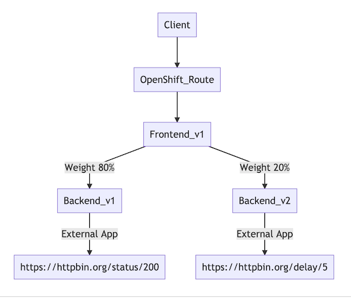

<!-- # Dynamic Routing Lab

Configure service mesh route rules to dynamically route and shape traffic between services -->

## Traffic Management
In this lab you dynamically alter routing between different versions of the backend service.
Routing within Service Mesh can be controlled by using Virtual Service and Routing Rules.

<!-- TOC -->

- [Traffic Management](#traffic-management)
- [Traffic Routing by Percentage](#traffic-routing-by-percentage)
  - [Kiali](#kiali)
  - [Destination Rule](#destination-rule)
  - [Virtual Service](#virtual-service)
  - [Test](#test)
- [Dark Launch by Mirroring Traffic](#dark-launch-by-mirroring-traffic)
- [Envoy Access Log](#envoy-access-log)
- [Cleanup](#cleanup)
- [Next Topic](#next-topic)

<!-- /TOC -->

<!-- Service Mesh Route rules control how requests are routed within service mesh.

Requests can be routed based on the source and destination, HTTP header fields, and weights associated with individual service versions. For example, a route rule could route requests to different versions of a service.

VirtualService defines a set of traffic routing rules to apply when a host is addressed. Each routing rule defines matching criteria for traffic of a specific protocol. If the traffic is matched, then it is sent to a named destination service (or subset/version of it) defined in the registry. The source of traffic can also be matched in a routing rule. This allows routing to be customized for specific client contexts.

DestinationRule defines policies that apply to traffic intended for a service after routing has occurred. These rules specify configuration for load balancing, connection pool size from the sidecar, and outlier detection settings to detect and evict unhealthy hosts from the load-balancing pool. -->

## Traffic Routing by Percentage

We can use Istio to route traffic to service based on HTTP header fields, and weights associated with individual service versions. For example, a route rule could route requests to different versions of a service.

We will use Istio to route 80% of traffic to backend v1 and 20% to backend v2

<!--  -->


### Kiali
* Navigate to Services, then select backend services
  
  

* Select Actions -> Request Routing

  

* Select tab Route To, adjust slider bar of backend v1 and backend v2 to 80% and 20% respectively then click Add Rule.
  
  

* Click Show Advanced Options, Select tab Traffic Policy and Enable option Add Load Balancer

  

* Select tab Request Matching, verify that Request Matching is set to Any Request then click Create

  
  

### Destination Rule

* Review Destination rule by select Istio Config then click backend DestinationRule
  
  

* Snippet of Destination Rule
  
  ```yaml
  spec:
    host: backend.user1.svc.cluster.local
    trafficPolicy:
      loadBalancer:
        simple: ROUND_ROBIN
    subsets:
      - labels:
          version: v1
        name: v1
      - labels:
          version: v2
        name: v2
  ```

  This destination rule define 2 subset of backend service called v1 and v2 by matching label "app" and "version" and set load balaner to use Round Robin alogrithm.

* For CLI user [destination-rule-backend-v1-v2.yaml](../istio-files/destination-rule-backend-v1-v2.yaml)

  ```bash
  oc apply -f istio-files/destination-rule-backend-v1-v2.yaml -n $USERID
  ``` 

### Virtual Service
* Navigate to Services and select backend VirtualService
* Snippet of Virtual Service
  
  ```yaml
  spec:
    hosts:
      - backend.user1.svc.cluster.local
    http:
      - route:
          - destination:
              host: backend.user1.svc.cluster.local
              subset: v1
            weight: 80
          - destination:
              host: backend.user1.svc.cluster.local
              subset: v2
            weight: 20
  ```

  This is virtual service of backend service that route 80% of traffic to subset v1 and 20% of traffic to subset v2

* For CLI, check [virtual-service-backend-v1-v2-80-20.yaml](../istio-files/virtual-service-backend-v1-v2-80-20.yaml)

  ```bash
  oc apply -f istio-files/virtual-service-backend-v1-v2-80-20.yaml -n $USERID
  ``` 

* Check status of Istio policies with CLI

  ```bash
  oc get istio-io -n $USERID
  ```

  Sample output

  ```bash
  NAME                                          HOST      AGE
  destinationrule.networking.istio.io/backend   backend   11m

  NAME                                         GATEWAYS   HOSTS                                 AGE
  virtualservice.networking.istio.io/backend              ["backend.user1.svc.cluster.local"]   11m
  ```

### Test

* Test with [run-50.sh](../scripts/run-50.sh)

  ```bash
  scripts/run-50.sh
  ```

  Sample output

  ```bash
  Backend:v1, Response Code: 200, Host:backend-v1-f4dbf777f-lm8h8, Elapsed Time:0.284061 sec
  Backend:v1, Response Code: 200, Host:backend-v1-f4dbf777f-lm8h8, Elapsed Time:0.602479 sec
  Backend:v1, Response Code: 200, Host:backend-v1-f4dbf777f-lm8h8, Elapsed Time:0.526853 sec
  Backend:v2, Response Code: 200, Host:backend-v2-7cf5cd78db-v7klv, Elapsed Time:6.570658 sec
  Backend:v1, Response Code: 200, Host:backend-v1-f4dbf777f-lm8h8, Elapsed Time:0.601078 sec
  Backend:v1, Response Code: 200, Host:backend-v1-f4dbf777f-lm8h8, Elapsed Time:0.546642 sec
  Backend:v1, Response Code: 200, Host:backend-v1-f4dbf777f-lm8h8, Elapsed Time:0.557983 sec
  Backend:v1, Response Code: 200, Host:backend-v1-f4dbf777f-lm8h8, Elapsed Time:0.550626 sec
  Backend:v1, Response Code: 200, Host:backend-v1-f4dbf777f-lm8h8, Elapsed Time:0.583994 sec
  ========================================================
  Total Request: 50
  Version v1: 42
  Version v2: 8
  ========================================================
  ```

* Check Kiali Graph
  - Select Menu Graph
  - Click Display -> Select Request Percentage
  - Change time frame to Last 5m

    

  - Check statistics of each service. From left menu Services, then select service e.g. backend-v1

    


## Dark Launch by Mirroring Traffic

Mirror all request to backend to backend-v3. Example of use cases are audit transaction or test new service.


* Run following command to create backend-v3

  ```bash
  oc apply -f ocp/backend-v3-deployment.yaml -n $USERID
  oc apply -f ocp/backend-v3-service.yaml -n $USERID
  ```

  **Remark: backend v3 create with app label backend-v3 and service name backend-v3 then backend v3 is not included in backend service. You verify [backend-service.yml](../ocp/backend-service.yaml) for this configuration**

* Navigate to backend virtual service and add mirror section then save

  ```yaml
  spec:
    hosts:
      - backend.user1.svc.cluster.local
    http:
      - route:
          - destination:
              host: backend.user1.svc.cluster.local
              subset: v1
            weight: 80
          - destination:
              host: backend.user1.svc.cluster.local
              subset: v2
            weight: 20
        mirror: 
          host: backend-v3
  ```

  This will mirror of http request to service backend-v3

* For CLI, check [virtual-service-backend-v1-v2-mirror-to-v3.yaml](../istio-files/virtual-service-backend-v1-v2-mirror-to-v3.yaml)

  ```bash
  oc apply -f istio-files/virtual-service-backend-v1-v2-mirror-to-v3.yaml -n $USERID
  ``` 
* Check backend-v3 pod's log by navigate to Workloads->backend-v3->Select tab Logs
   
  

* Run following command on Web Terminal
  
  ```bash
  curl $FRONTEND_URL
  ```
* Verify that request is mirrored to backend-v3 pod's by check backend-v3 pod's log.
  
  ```bash
  2021-08-30T15:42:22.292810166Z 15:42:22 INFO  [co.ex.qu.BackendResource] (executor-thread-0) Return Code: 200
  2021-08-30T15:42:22.292890207Z 15:42:22 INFO  [co.ex.qu.BackendResource] (executor-thread-0) Response Body: Backend version:v3, Response:200, Host:backend-v3-758695c978-tccv2, Status:200, Message: 
  2021-08-30T15:42:22.293543859Z 15:42:22 INFO  [io.qu.ht.access-log] (executor-thread-0) 127.0.0.1 - - 30/Aug/2021:15:42:22 +0000 "GET / HTTP/1.1" 200 178 "-" "-"
  ```

## Envoy Access Log

Envoy's access log can be printed to envoy (sidecar) standard output. This can be enabled by update ServiceMeshControl basic in project $USERID-istio-system

* Check ServiceMeshControlPlane basic 
  
  ```bash
  oc get smcp/basic -n $USERID-istio-system -o yaml| grep -A3 accessLogging
  ```

  Output
  ```yaml
  accessLogging:
    file:
      encoding: TEXT
      name: /dev/stdout
  ```
<!-- 

  *accessLogFormat* if you want custom log format. Check [Envoy Document](https://www.envoyproxy.io/docs/envoy/latest/configuration/observability/access_log#format-rules) for more details. -->


* Check backend's access log by using oc logs command
  
  ```bash
  oc logs -f -c istio-proxy -n ${USERID} $(oc get pods -n ${USERID} | grep backend | head -n 1 | awk '{print $1}')
  ``` 

  Access log show as follow:
  
  ```log
  [2021-08-30T16:31:24.608Z] "GET / HTTP/1.1" 200 - "-" "-" 0 102 14 13 "-" "-" "ac64e3fd-bb3f-9aea-b7fd-db7d9b5c455c" "backend:8080" "127.0.0.1:8080" inbound|8080|http|backend.user1.svc.cluster.local 127.0.0.1:55204 10.128.2.67:8080 10.131.0.232:35872 outbound_.8080_.v1_.backend.user1.svc.cluster.local default
  [2021-08-30T16:31:16.874Z] "- - -" 0 - "-" "-" 5028 8511 15066 - "-" "-" "-" "-" "3.209.149.47:443" PassthroughCluster 10.128.2.67:49944 3.209.149.47:443 10.128.2.67:49942 - -
  ```
  
  Each request contains 2 lines of log incoming request from application container (backend-v1) and outgoing request to httpbin.org
  - Incoming traffic *backend.user1.svc.cluster.local 127.0.0.1:55204 10.128.2.67:8080 10.131.0.232:35872 outbound_.8080_.v1_.backend.user1.svc.cluster.local*
    - 10.128.2.67 is IP of backend-v1
    - 10.131.0.232 is IP of frontend-v1
  - Outgoing traffic *10.128.2.67:49944 3.209.149.47:443 10.128.2.67:49942*
    - 10.128.2.67 is IP of backend-v1
    - 3.209.149.47 is IP address of httpbin.org

## Cleanup

Run oc delete command to remove Istio policy.

```bash
oc apply -f istio-files/virtual-service-backend-v1-v2-80-20.yaml -n $USERID
oc apply -f istio-files/destination-rule-backend-v1-v2.yaml -n $USERID
```

Delete all backend-v3 related

```bash
oc delete -f ocp/backend-v3-deployment.yaml -n $USERID
oc delete -f ocp/backend-v3-service.yaml -n $USERID
```

<!-- You can also remove Istio policy by using Kiali Console by select Istio Config menu on the left then select each configuration and select menu Action on the upper right of page. Then click Delete
 -->

<!-- If you want to disable envoy's access log.
```bash
scripts/envoy-log-disable.sh
``` -->

## Next Topic

[Ingress](./05-ingress.md)