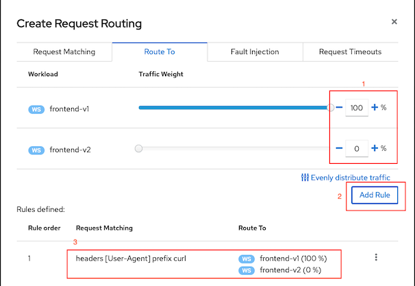
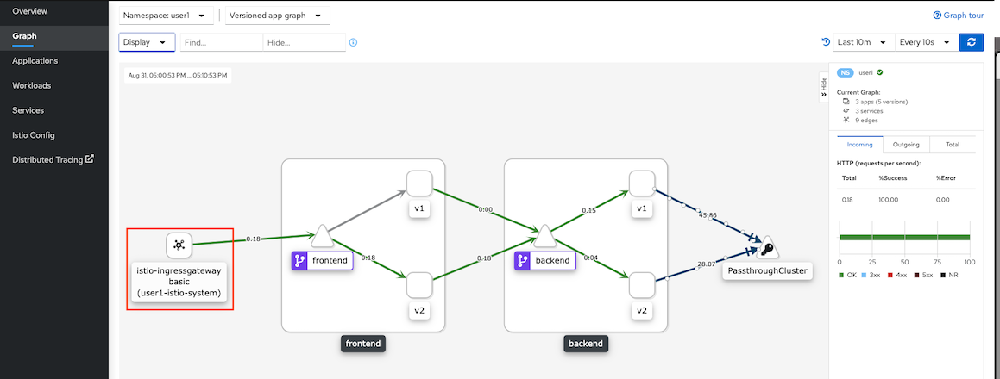

# Istio Gateway and Routing by HTTP header

- [Istio Gateway and Routing by HTTP header](#istio-gateway-and-routing-by-http-header)
  - [Deploy Application](#deploy-application)
  - [Istio Ingress Gateway](#istio-ingress-gateway)
    - [Kiali](#kiali)
    - [Configuration Details](#configuration-details)
    - [CLI](#cli)
    - [Test](#test)
  - [Next Topic](#next-topic)

Configure *Istio Ingress Gateway* to control traffic that entering mesh by routing based on HTTP Header

<!--  -->

## Deploy Application


* Deploy frontend-v2
  
  ```bash
  oc apply -f ocp/frontend-v2-deployment.yaml -n $USERID
  oc get pods -n $USERID
  ```
  
  Sample Output
  
  ```bash
  NAME                           READY   STATUS              RESTARTS   AGE
  backend-v1-f4dbf777f-5bnzb     2/2     Running             0          25m
  backend-v2-5758c6c584-p6jj2    2/2     Running             0          25m
  frontend-v1-66fbd89459-tnjg4   2/2     Running             0          21m
  frontend-v2-655bb9c9c-chlnf    0/2     ContainerCreating   0          0s
  ```

* Verify that frontend service contains 2 pods
  - Navigate OpenShift Administration Console to Networking -> Services -> frontend
  - Select tab Pods
    
    

## Istio Ingress Gateway
### Kiali
* Use Kiali, Select Services -> frontend then Click Actions -> Request Routing
* On tab Request Matching set to check header User-Agent that start with curl and click Add Match
  
  

* Click tab Route To and set weight 100% to frontend-v1 and Click Add Rule

  

* Click tab Request Matching, Click "headers[User-Agent] prefix curl" to remove previously added matching.
* Click tab Route To and set weight 100% to frontend-v2 and Click Add Rule
  
  

* Click Show Advanced Options and set Virtual Service Hosts
  - Check for cluster'domain for assign to virtual service host with format frontend-istio-$USERID.apps.<domain>
    
    ```bash
    echo frontend-istio-$USERID.apps.$(oc whoami --show-console | awk -F'apps.' '{print $2}')
    ```
  - Add frontend virtual service

    

* Click tab Gateways and enable Add Gateway then set port to 80 and Click Create
  
  
    
* OpenShift Service Mesh will automatically create route in project $USERID-istio-system
  - Open OpenShift Administration Console and navigate to Networking -> Route
    
    

  - Or use following CLI
    
### Configuration Details
* Review [Istio's Gateway](../istio-files/gateway.yaml) config by Navigate to Istio Config->frontend-gateway
  - This gateway listen to port 8080 for HTTP protocol
  - Mapped to host frontend-istio-$USERID.apps.DOMAIN
    
    ```yaml
    spec:
      servers:
        - hosts:
            - frontend-istio-user1.apps.cluster-f25e.f25e.sandbox1804.opentlc.com
          port:
            name: http
            number: 80
            protocol: HTTP
      selector:
        istio: ingressgateway
    ```

* Review [frontend virtual service](../istio-files/virtual-service-frontend.yaml)
  - This virtual service's host is mapped to route's URL
  - This virtual service is mapped to gateway frontend-gateway in project user1

    ```yaml
    spec:
      hosts:
        - frontend-istio-user1.apps.cluster-f25e.f25e.sandbox1804.opentlc.com
      gateways:
        - user1/frontend-gateway
      http:
        - match:
            - headers:
                User-Agent:
                  prefix: curl
          route:
            - destination:
                host: frontend.user1.svc.cluster.local
                subset: v1
              weight: 100
            - destination:
                host: frontend.user1.svc.cluster.local
                subset: v2
              weight: 0
    ```

### CLI
* Run following command to create destination rules,virtual service and gateway for frontend service

  ```bash
  DOMAIN=$(oc whoami --show-console | awk -F'apps.' '{print $2}')
  oc apply -f istio-files/destination-rule-frontend-v1-v2.yaml -n $USERID
  cat istio-files/virtual-service-frontend-header-to-v1.yaml | sed s/USERID/$USERID/ | sed s/DOMAIN/$DOMAIN/ | oc apply -n $USERID -f -
  cat istio-files/gateway.yaml | sed s/USERID/$USERID/ | sed s/DOMAIN/$DOMAIN/ | oc apply -n $USERID -f -
  ```

### Test
* Get Istio gateway frontend route

  ```bash
  export GATEWAY_URL=$(oc get route $(oc get route -n $USERID-istio-system | grep frontend | awk '{print $1}') -n $USERID-istio-system -o yaml  -o jsonpath='{.spec.host}')
  echo $GATEWAY_URL
  ```

* Test with curl, response will be returned from frontend-v1
  
  ```bash
  curl -v http://$GATEWAY_URL
  ```
  
  Check request header
  
  ```bash
  > GET / HTTP/1.1
  > Host: frontend-istio-user1.apps.cluster-f25e.f25e.sandbox1804.opentlc.com
  > User-Agent: curl/7.64.1
  > Accept: */*
  >
  < HTTP/1.1 200 OK
  ```

* Test with curl and set User-Agent to foo-bar, response will be returned from frontend-v2
  
  ```bash
  curl -H 'User-Agent: foo-bar' -v http://$GATEWAY_URL
  ```

  Check request header
  
  ```bash
  > GET / HTTP/1.1
  > Host: frontend-istio-user1.apps.cluster-f25e.f25e.sandbox1804.opentlc.com
  > Accept: */*
  > User-Agent: foo-bar
  >
  < HTTP/1.1 200 OK
  ```
* Check Kiali Graph
  - Generate workload to frontend service with following [bash script](../scripts/run-50-gateway.sh) or run k6
    
    ```bash
    scripts/run-50-gateway.sh
    ```
    
    K6 Load Test
    
    ```bash 
      oc run load-test -n $USERID-load-test -i --rm \
      --image=loadimpact/k6 --rm=true --restart=Never \
      --  run -  < scripts/load-test-k6.js \
      -e URL=http://$GATEWAY_URL -e THREADS=3 -e DURATION=2m -e RAMPUP=2s -e RAMPDOWN=0s
    ```
  
  - Kiali Graph show that requests are from istio-ingressgateway comparing with "Unknown" from previous lab that we access frontend service through normal OpenShift's route exposed from frontend service.

    

## Next Topic

[Fault Injection](./06-fault-injection.md)