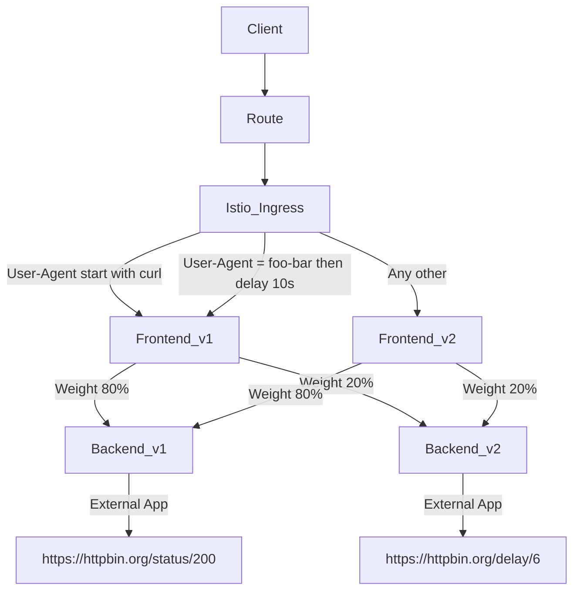
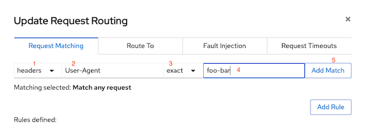
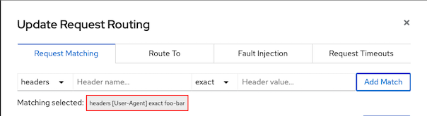
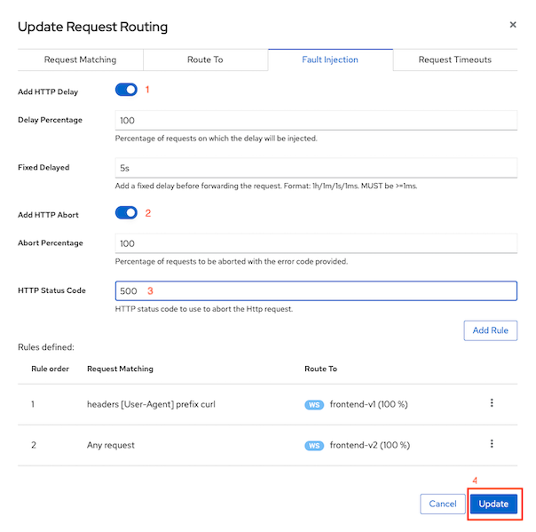
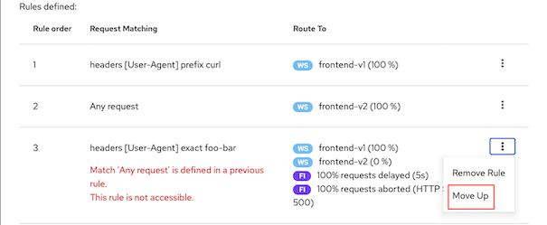
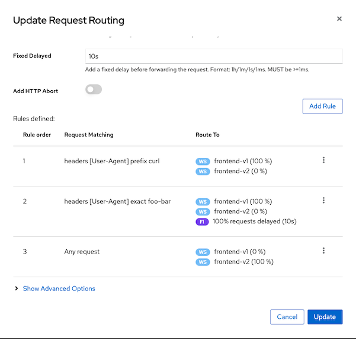

# Fault Injection

- [Fault Injection](#fault-injection)
  - [Inject Delay](#inject-delay)
    - [Test](#test)
  - [Cleanup](#cleanup)
  - [Next Topic](#next-topic)


Fault injection is strategy to test resiliency of your service. We will configure virtual service to delay 10sec if HTTP Header User-Agent is matched with text foo-bar



## Inject Delay
* Navigate to Services->frontend and select Actions->Request Routing
  
  

* Add Request Matching for Header User-Agent exact match with text foo-bar and click Add Match

  

  Result

  

* Click Route To and set weight 100% to frontend-v1
* Click Fault Injection and 
  - Add HTTP delay with 5s for 100% of request
  - Add HTTP abort with status code 500

  

* Re-order rules order by Move newly added rule up 1 order.
  
  

* Click Update

  

* Navigate to Istio Config->frontend virtual service to verify fault injection config.
  
  ```yaml
      - fault:
          abort:
            httpStatus: 500
            percentage:
              value: 100
          delay:
            fixedDelay: 5s
            percentage:
              value: 100
        match:
          - headers:
              User-Agent:
                exact: foo-bar
  ``` 
  

* For CLI, run following command to update [frontend virtual service with fault injection](../istio-files/virtual-service-frontend-fault-inject.yaml)

  ```bash
  cat istio-files/virtual-service-frontend-fault-inject.yaml | sed s/USERID/$USERID/ | sed s/DOMAIN/$DOMAIN/ | oc apply -n $USERID -f -
  ```

### Test

* Test with header User-Agent set to foo-bar
  
  ```bash
  curl -H 'User-Agent: foo-bar' -s -w "\nElapsed Time:%{time_total}\n" $GATEWAY_URL
  ```

  Sample output
  
  ```bash
  > GET / HTTP/1.1
  > Host: frontend-istio-user1.apps.cluster-f25e.f25e.sandbox1804.opentlc.com
  > Accept: */*
  > User-Agent: foo-bar
  > 
  < HTTP/1.1 500 Internal Server Error
  < content-length: 18
  < content-type: text/plain
  < date: Tue, 31 Aug 2021 10:27:47 GMT
  < server: istio-envoy
  < set-cookie: 8097191f7a5222ce5d42040bacdfc8bb=938ce0a632cb66b8428d037ceba1ea93; path=/; HttpOnly
  < 
  * Connection #0 to host frontend-istio-user1.apps.cluster-f25e.f25e.sandbox1804.opentlc.com left intact
  fault filter abort
  Elapsed Time:5.035663
  ```

* Test again with header foo not equal to bar

  ```bash
  curl -H 'User-Agent: chromium' -s -w "\nElapsed Time:%{time_total}\n" $GATEWAY_URL
  ```

  Sample output

  ```bash
  Frontend version: 2.0.0 => [Backend: http://backend:8080, Response: 200, Body: Backend version:v1, Response:200, Host:backend-v1-f4dbf777f-j8drc, Status:200, Message: Hello, Quarkus]
  Elapsed Time:0.914083
  ```

## Cleanup

Run oc delete command to update Istio policy.

```bash
oc delete dr frontend -n $USERID
oc delete vs frontend -n $USERID
cat istio-files/virtual-service-frontend-single-version.yaml| sed s/USERID/$USERID/ | sed s/DOMAIN/$DOMAIN/ | oc apply -n $USERID -f -
cat istio-files/destination-rule-frontend.yaml -n $USERID | sed s/USERID/$USERID/ | oc apply -n $USERID -f -
oc delete deployment/frontend-v2 -n $USERID 
```

## Next Topic

[Timeout and Reties](./07-timeout.md)