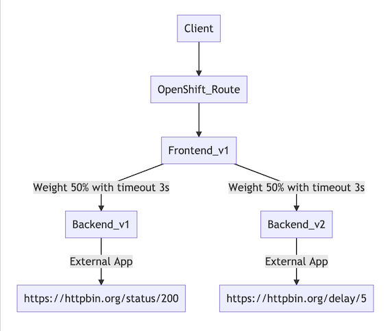
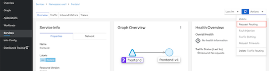
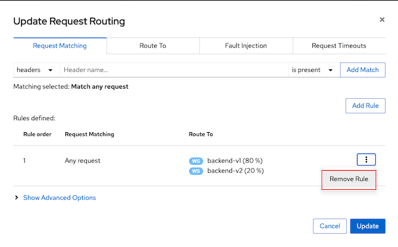
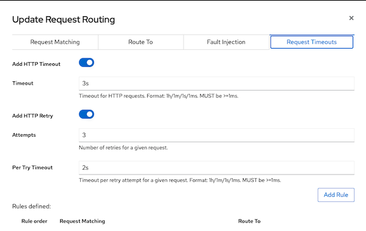
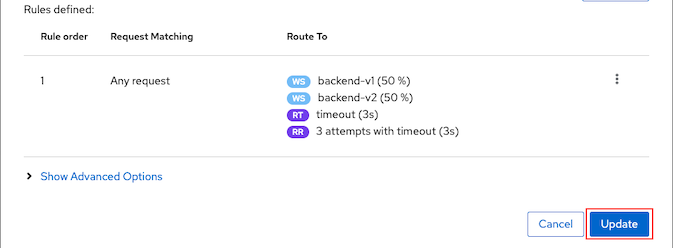
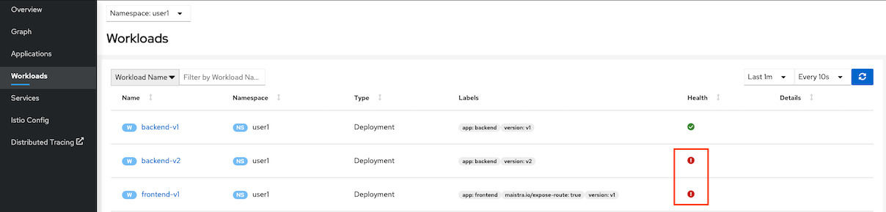
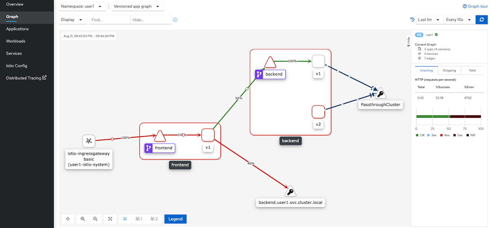

# Control Traffic with Timeout and Retries

<!-- TOC -->

- [Control Traffic with Timeout and Retries](#control-traffic-with-timeout-and-retries)
  - [Setup](#setup)
  - [Cleanup](#cleanup)
  - [Next Topic](#next-topic)

<!-- /TOC -->

## Setup

Currently backend v2 is set to delay response in 6 sec. We will set backend virtual service to wait for 3 sec (timeout 3 sec).  Frontend will received HTTP response with Gateway Timeout (504) if elapsed time is longer than timeout period.



<!-- Deploy frontend v1, backend v1 and backend v2.

```bash
oc apply -f ocp/frontend-v1-deployment.yml -n $USERID
oc apply -f ocp/frontend-service.yml -n $USERID
oc apply -f ocp/frontend-route.yml -n $USERID
oc apply -f ocp/backend-v1-deployment.yml -n $USERID
oc apply -f ocp/backend-v2-deployment.yml -n $USERID
oc apply -f ocp/backend-service.yml -n $USERID
watch oc get pods -n $USERID
#or 
#oc get pods -w -n $USERID
#Wait until all backend-v1 pods status are Runnings and all container in pods are ready (2/2)
``` -->
* Services->backend then Actions -> Request Routing
  
  

* Remove existing 80/20 rule
  
  

* Select tab Request Timeouts
  - Add HTTP Timeout for 3s
  - Add HTTP Retry with 3 Attempts and wat 2s per retry
  - Click Add Rule
  
  

* Verify rules and click Update.
  
  

* For CLI. Run following command to apply [virtual service](../istio-files/virtual-service-backend-v1-v2-50-50-3s-timeout.yaml) with timeout and retries to backend service.
  
  ```bash
  oc delete dr/backend -n $USERID
  cat istio-files/destination-rule-backend-v1-v2.yaml|sed s/USERID/$USERID/g|oc apply -n $USERID -f - 
  cat istio-files/virtual-service-backend-v1-v2-50-50-3s-timeout.yaml|sed s/USERID/$USERID/g|oc apply -n $USERID -f - 
  ```

* Verify backend virtual service by navigate to Istio config then select backend virtual service
  
  ```yaml
    http:
      - timeout: 3s
        retries:
          attempts: 3
          perTryTimeout: 2s
          retryOn: 'gateway-error,connect-failure,refused-stream'
  ```
## Test
* Test with cRUL

  ```bash
  export GATEWAY_URL=$(oc get route $(oc get route -n $USERID-istio-system | grep frontend | awk '{print $1}') -n $USERID-istio-system -o yaml  -o jsonpath='{.spec.host}')
  curl $GATEWAY_URL
  ```

  Result when frontend request to backend-v2

  ```bash
  Frontend version: 1.0.0 => [Backend: http://backend:8080, Response: 504, Body: upstream request timeout]
  ```
* Test with bash script [run-50-gateway.sh](../scripts/run-50-gateway.sh)

  ```bash
  scripts/run-50-gateway.sh
  ```

  Sample output

  ```log
  Backend:v1, Response Code: 200, Host:backend-v1-f4dbf777f-5bnzb, Elapsed Time:0.627207 sec
  Backend:, Response Code: 504, Host:, Elapsed Time:3.575536 sec
  Backend:v1, Response Code: 200, Host:backend-v1-f4dbf777f-5bnzb, Elapsed Time:0.603720 sec
  Backend:, Response Code: 504, Host:, Elapsed Time:3.593024 sec
  Backend:v1, Response Code: 200, Host:backend-v1-f4dbf777f-5bnzb, Elapsed Time:0.625216 sec
  Backend:v1, Response Code: 200, Host:backend-v1-f4dbf777f-5bnzb, Elapsed Time:0.593476 sec
  ========================================================
  Total Request: 50
  Version v1: 22
  Version v2: 0
  ========================================================
  ```
* Navigate to Workloads and check Health of backend-v2 and frontend
  
  

* Check Graph
  
  
<!-- Check Graph in Kiali Console with Response time.

 -->


## Cleanup
Run oc delete command to remove Istio policy.

```bash
oc delete vs backend -n $USERID
oc delete dr backend -n $USERID
```

## Next Topic

[Circuit Breaker](./08-circuit-breaker.md)