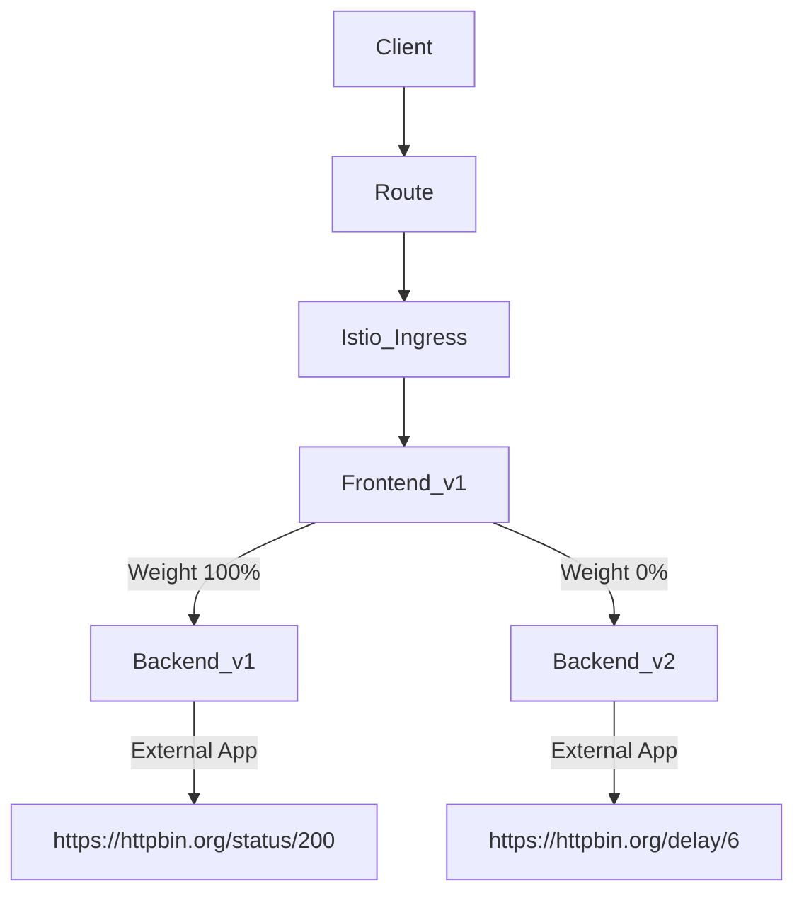
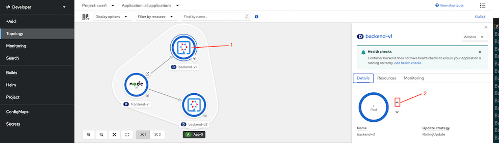
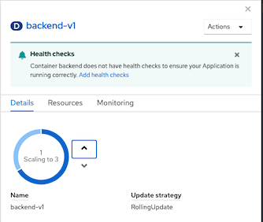
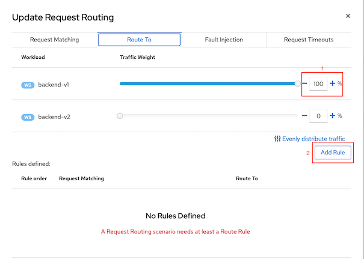
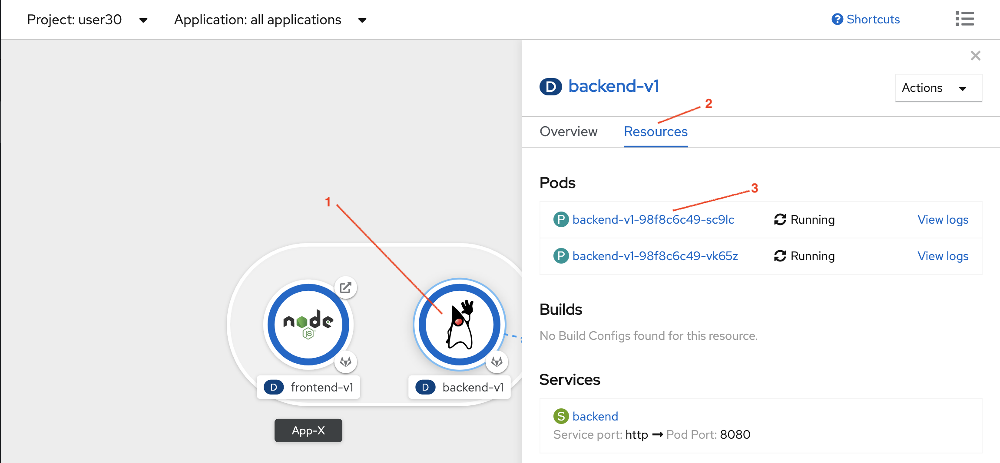
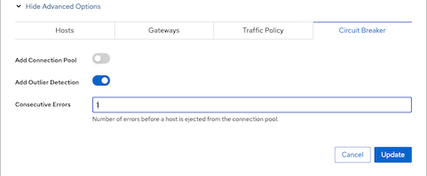
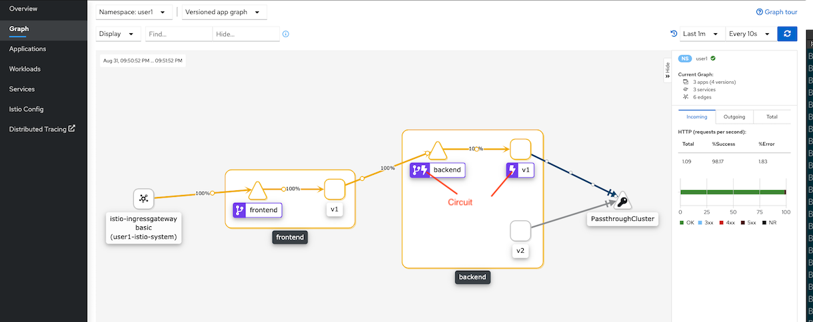

# Service Resilience by Circuit Breaker Lab

Circuit breaking is one of pattern to build reslilient microservices. The idea is limit the impact of failures.

In our lab, we will simulate that one pod of backend service has some error (Return HTTP 504). We will use circuit breaker with pool ejection concept that if error happen then that particular pod will be ejected from pool in a period of time. This will result that frontend will not call that pod. So, failure will be minimized.

<!-- TOC -->

- [Service Resilience by Circuit Breaker Lab](#service-resilience-by-circuit-breaker-lab)
  - [Setup](#setup)
  - [Clean Up](#clean-up)
  - [Next Topic](#next-topic)

<!-- /TOC -->


## Setup

Setup microservices apps by set 100% of request to backend-v1 and scale backend-v1 to 3 pods




* Scale backend-v1 to 3 pods with Developer Console
  - Select backend-v1, and click upper arrow to scale to 3 pods
    
    

    Scaling up.

    
  
  - Use CLI
    
    ```bash
    oc scale deployment backend-v1 --replicas=3 -n $USERID
    ```

* Create Destination Rule and Virtual Service with Kiali Console to send 100% of request to backend-v1
  - Navigate to Services->backend then select Actions->Request Routing
  - Select tab Route To and set 100% of request to backend-v1 and click Add Rule

    
  
  - Click Create

* Check pod with availability zone
  
  ```bash
  oc get pods -o=custom-columns="NAME:.metadata.name,AZ:.metadata.labels['topology\.kubernetes\.io/zone']" -n $USERID
  ```

  Example of output
  
  ```bash
  NAME                           AZ
  backend-v1-f4dbf777f-52qv6     us-east-2b
  backend-v1-f4dbf777f-5bnzb     us-east-2a
  backend-v1-f4dbf777f-9pcll     us-east-2a
  backend-v2-5758c6c584-p6jj2    us-east-2a
  frontend-v1-6c556c95bd-5ndwl   us-east-2a
  ```

* Select one of backend-v1 pod to return 504. If there are one or more backend-v1 pod stay in the same AZ of frontend-v1 then select one of them.
  Remark: Envoy is check for response code 503 and retry automatically then we set to 504 for this lab

  From above example frontend-v1 is stay at us-east-2a then I selected backend-v1-f4dbf777f-9pcll to return 504
  
  ```bash
  POD=backend-v1-f4dbf777f-9pcll
  oc exec $POD -n $USERID -c backend  -- curl -s http://localhost:8080/not_ready
  echo "\nPod $POD will return 504"
  ```

* Test with [bash script](../scripts/loop-frontend.sh)
  
  ```bash
  scripts/loop-frontend.sh
  ```
* Check result. 
  
  ```bash
  Backend:v1, Response Code: 504, Host:backend-v1-f4dbf777f-9pcll, Elapsed Time:0.576757 sec
  Backend:v1, Response Code: 504, Host:backend-v1-f4dbf777f-9pcll, Elapsed Time:0.648805 sec
  Backend:v1, Response Code: 200, Host:backend-v1-f4dbf777f-5bnzb, Elapsed Time:0.615064 sec
  Backend:v1, Response Code: 504, Host:backend-v1-f4dbf777f-9pcll, Elapsed Time:0.677088 sec
  ========================================================
  Total Request: 50
  200 OK: 24
  NOT 200 OK: 26
  ========================================================
  ```
  
  You will find that number of 200 OK may not be near 50% not 66% This happened because Envoy has feature called **Localcity Load Balancing** and enabled by default. A locality defines geographic location by region, zone and subzone. 
  
  From above example. There are 2 of backend-v1 pods stay in the same AZ with frontend-v1. Then result is nearly 50% of 200 OK and 50% of 504

  
<!-- Crete deployment  backend-v1-f4dbf777f-52qv6

```bash
oc delete -f ocp/backend-v2-deployment.yml -n $USERID
oc scale deployment backend-v1 --replicas=2 -n $USERID
oc apply -f istio-files/destination-rule-backend-v1.yml -n $USERID
oc apply -f istio-files/virtual-service-backend.yml -n $USERID
watch oc get pods -n $USERID
#or 
#oc get pods -w -n $USERID
#Wait until all backend-v1 pods status are Runnings and all container in pods are ready (2/2)
```

Sample output

```bash
NAME                          READY   STATUS    RESTARTS   AGE
backend-v1-6ddf9c7dcf-sqxqz   2/2     Running   0          8h
backend-v1-6ddf9c7dcf-vm6kb   2/2     Running   0          8h
frontend-v1-655f4478c-wn7wr   2/2     Running   0          9h
``` -->

<!-- You can also scaleup pod by using OpenShift Developer Console. From Topology view, click on Backend v1 donut, Overview tab.

Scale pod to 2 by click upper arrow icon.


We will force one backend-v1 pod to return 504. This can be done by rsh into pod the curl to /stop (backend-v1 will always return 504 after receiving /stop. This is for demo)


Envoy is check for response code 503 and retry automatically. We will force one of backend's pod to return 503 by run following command.

```bash
oc exec -n $USERID -c backend $(oc get pod -n $USERID | grep -m1 backend | cut -d " " -f1) -- curl -s http://localhost:8080/not_ready
```
Envoy also try to connect to another pod within same node if possible. Check deployment of backend-v1 and frontend-v1 for pod anti-affinity. Then frontend-v1 and backend-v1 will not scheduled to the same node.

Envoy also has feature called **Localcity Load Balancing** and enabled by default. A locality defines geographic location by region, zone and subzone. 

For this demo, we disable this in [control plane configuration](../install/basic-install.yml)

```yaml
meshConfig:
    localityLbSetting:
      enabled: false
```

Verify that pod in previous step will return 503
```bash
oc exec -n $USERID -c backend $(oc get pod -n $USERID | grep -m1 backend | cut -d " " -f1) -- curl -v -s http://localhost:8080
```
Sample output
```
...
< HTTP/1.1 503 Service Unavailable
< Content-Encoding: text/plain
< Content-Length: 126
< Content-Type: text/plain;charset=UTF-8
...
```
Test with [run-50.sh](../scripts/run-50.sh). All response will be 200 OK


Set that backend pod to return 504 instead of 503

```bash
oc exec -n $USERID -c backend $(oc get pod -n $USERID | grep -m1 backend | cut -d " " -f1) -- curl -s http://localhost:8080/ready
oc exec -n $USERID -c backend $(oc get pod -n $USERID | grep -m1 backend | cut -d " " -f1) -- curl -s http://localhost:8080/stop
#or
oc exec -n $USERID  -c backend <pod name>  -- curl -s  http://localhost:8080/ready
oc exec -n $USERID  -c backend <pod name>  -- curl -s  http://localhost:8080/stop
```

Sample output
```bash
Backend version:v1, Response:200, Host:backend-v1-6ddf9c7dcf-sqxqz, Status:200, Message: Readiness: true
Backend version:v1, Response:200, Host:backend-v1-6ddf9c7dcf-sqxqz, Status:200, Message: Liveness: false

```

Then verify that pod will in previous step will return 504 when recieving request.

```bash
oc exec -n $USERID -c backend $(oc get pod -n $USERID | grep -m1 backend | cut -d " " -f1) -- curl -s  -w "\nResponse Code:%{response_code}" http://localhost:8080

#or

oc exec -n $USERID  -c backend <pod name>  -- curl -s  -w "\nResponse Code:%{response_code}" http://localhost:8080
```

Sample output

```bash
Backend version:v1, Response:504, Host:backend-v1-6ddf9c7dcf-sqxqz , Status:504, Message: Application liveness is set to false
Response Code:504
```


You can also use OpenShift Developer Console. From Topology view, click on Backend v1 donut, Resources tab, click on one pod.



select Terminal tab then run cURL command


Test with [run50.sh](../scripts/run-50.sh) and check that response is round robin between 504 and 200 

```bash
scripts/run-50.sh
```

Sample output

```bash
...
Backend:v1, Response Code: 200, Host:backend-v1-98f8c6c49-cdvbh, Elapsed Time:1.508606 sec
Backend:v1, Response Code: 504, Host:backend-v1-98f8c6c49-vk65z, Elapsed Time:0.161270 sec
Backend:v1, Response Code: 200, Host:backend-v1-98f8c6c49-cdvbh, Elapsed Time:0.367105 sec
Backend:v1, Response Code: 504, Host:backend-v1-98f8c6c49-vk65z, Elapsed Time:0.139964 sec
Backend:v1, Response Code: 200, Host:backend-v1-98f8c6c49-cdvbh, Elapsed Time:0.358144 sec
Backend:v1, Response Code: 504, Host:backend-v1-98f8c6c49-vk65z, Elapsed Time:0.148808 sec
...
``` -->

## Circuit Breaker and Pool Ejection
* Update backend virtual service with Kiali by navigate to Services->backend then select Actions -> Request Routing
* Click Show Advanced Option then select tab Circuit Breaker
* Enable outlier detection with 1 consecutive errors and click Update
  
  

* Review [backend destination rule](../istio-files/destination-rule-backend-circuit-breaker-with-pool-ejection.yaml) by navigate to Istio Config -> backenddestination rule
  
  ```yaml
  spec:
    host: backend.user1.svc.cluster.local
    trafficPolicy:
      outlierDetection:
        consecutiveErrors: 1
  ```  
* Update backend destination rule with
  
  ```yaml
  outlierDetection:
    consecutiveErrors: 1
    baseEjectionTime: 15m
    interval: 15m
    maxEjectionPercent: 100
  ```

  Explain traffice policy configuration:

  - Detect error with condition:
  - If found 1 consecutive error (consecutiveErrors)
  - then eject that pod from pool for 15 minutes (baseEjectionTime)
  - All of pods can be ejected (maxEjectionPercent)
  - check again within 15 minutes (interval)

* For CLI, apply [destination rule](../istio-files/destination-rule-backend-circuit-breaker-with-pool-ejection.yaml) and [virtual service](../istio-files/destination-rule-backend-circuit-breaker-with-pool-ejection.yaml) to enable circuit breaker with pool ejection for backend service

  ```bash
  cat istio-files/destination-rule-backend-circuit-breaker-with-pool-ejection.yaml|sed s/USERID/$USERID/g|oc apply  -n $USERID -f - 
  cat istio-files/virtual-service-backend.yaml|sed s/USERID/$USERID/g|oc apply  -n $USERID -f - 
  ```
* Test with [bash script](../scripts/loop-frontend.sh)
  
  ```bash
  scripts/loop-frontend.sh
  ```
* Check result. 
  
  ```bash
  Backend:v1, Response Code: 200, Host:backend-v1-f4dbf777f-5bnzb, Elapsed Time:0.622154 sec
  Backend:v1, Response Code: 200, Host:backend-v1-f4dbf777f-5bnzb, Elapsed Time:0.417477 sec
  Backend:v1, Response Code: 200, Host:backend-v1-f4dbf777f-5bnzb, Elapsed Time:1.273972 sec
  Backend:v1, Response Code: 200, Host:backend-v1-f4dbf777f-5bnzb, Elapsed Time:0.595865 sec
  Backend:v1, Response Code: 200, Host:backend-v1-f4dbf777f-5bnzb, Elapsed Time:0.584061 sec
  Backend:v1, Response Code: 200, Host:backend-v1-f4dbf777f-5bnzb, Elapsed Time:0.587021 sec
  ========================================================
  Total Request: 50
  200 OK: 49
  NOT 200 OK: 1
  ========================================================
  ```

  Notice that you will get 504 only one time. Because that particular pod is ejected from pool and only pods those return 200 OK still stayed in pool.


* Check Kiali Graph

  

## Clean Up

Run oc delete command to remove Istio policy.

```bash
oc delete dr,vs backend -n $USERID
oc delete dr,vs frontend -n $USERID
oc delete gateway frontend-gateway -n $USERID
```

## Next Topic

[Secure with mTLS](./09-securing-with-mTLS.md)
