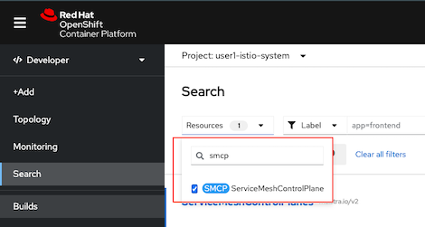

# Secure Service with Mutual TLS

Mutual TLS is quite cubersome for develop to authenticate with client side certificate. Istio sidecar can automatically validate mutual TLS for communication within Mesh and also with ingress traffic.

<!-- TOC -->

- [Secure Service with Mutual TLS](#secure-service-with-mutual-tls)
  - [Setup mTLS for pod to pod communication](#setup-mtls-for-pod-to-pod-communication)
    - [Pod Liveness and Readiness](#pod-liveness-and-readiness)
    - [Test](#test)
  - [Istio Ingress Gateway with TLS](#istio-ingress-gateway-with-tls)
  - [Istio Ingress Gateway with mTLS](#istio-ingress-gateway-with-mtls)
  - [Clean Up](#clean-up)
  - [Next Topic](#next-topic)

<!-- /TOC -->

## Setup mTLS for pod to pod communication

* Deploy Application to project USERID

  ```bash
  DOMAIN=$(oc whoami --show-console | awk -F'apps.' '{print $2}')
  oc delete dr,vs --all -n $USERID
  oc delete gateway frontend-gateway -n $USERID
  oc delete all --all -n $USERID
  oc apply -f ocp/frontend-v1-deployment.yaml -n $USERID
  oc patch deployment frontend-v1 -p '{"spec":{"template":{"metadata":{"annotations":{"sidecar.istio.io/inject":"true"}}}}}' -n $USERID
  oc apply -f ocp/frontend-service.yaml -n $USERID
  oc apply -f ocp/backend-v1-deployment.yaml -n $USERID
  oc apply -f ocp/backend-v2-deployment.yaml -n $USERID
  oc apply -f ocp/backend-service.yaml -n $USERID
  cat istio-files/destination-rule-backend-v1-v2.yaml|sed s/USERID/$USERID/g|oc apply -n $USERID -f -
  cat istio-files/virtual-service-backend-v1-v2-50-50.yaml|sed s/USERID/$USERID/g|sed s/DOMAIN/$DOMAIN/g|oc apply -n $USERID -f -
  cat istio-files/destination-rule-frontend.yaml|sed s/USERID/$USERID/g|oc apply -n $USERID -f -
  cat istio-files/virtual-service-frontend-single-version.yaml|sed s/USERID/$USERID/g|sed s/DOMAIN/$DOMAIN/g|oc apply -n $USERID -f -
  cat istio-files/gateway.yaml | sed s/USERID/$USERID/ | sed s/DOMAIN/$DOMAIN/ | oc apply -n $USERID -f -
  ```

* Edit Istio Control Plane to enable auto mtls
  
  mTLS configuration is managed by ServiceMeshControlPlane CRD. We will enable mtls for both control plane and data plane

  - Use OpenShift Developer Console. Select project $USERID-istio-system navigate to Search -> Resources and input smcp

    

  - Select basic

    

  - Click YAML tab, Press Ctrl-F and input *"mtls: false"*

    
    
  - Update ServiceMeshControlPlane with 
    
    ```yaml
      security:
        controlPlane:
          mtls: true
          automtls: true
        dataPlane:
          mtls: true
          automtls: true
    ```
<!-- * Navigate to Kiali Graph and select checkbox security
  
   -->

<!-- * Generate traffic and check Kiali graph
  - Run [loop-frontend.sh](../scripts/loop-frontend.sh)
    
    ```bash
    scripts/loop-frontend.sh
    ```

  - Check Kiali Graph
  -  -->

### Pod Liveness and Readiness

* Enable Liveness nad Readiness on backend-v1
  
  ```bash
  oc set probe deployment backend-v1 \
   --readiness --get-url=http://:8080/q/health/ready \
   --initial-delay-seconds=5 --failure-threshold=1 --period-seconds=5 -n $USERID
    oc set probe deployment backend-v1 \
   --liveness --get-url=http://:8080/q/health/live \
   --initial-delay-seconds=5 --failure-threshold=1 --period-seconds=5 -n $USERID
  ```
* Check for pod status
  
  ```bash
  watch oc get pods -l app=backend,version=v1 -n $USERID
  ```
  
  Example of output

  ```bash
  NAME                          READY   STATUS            RESTARTS   AGE
  backend-v1-5846f59c84-p6tn5   1/2     CrashLoopBackOff   4          68s
  ```
  
  Remark: Liveness and Readiness probe fail because kubelet cannot connect to port 8080 anymore.

* Rewrite HTTP probe by annotation to deployment 

  ```bash
  oc patch deployment/backend-v1 -p '{"spec":{"template":{"metadata":{"annotations":{"sidecar.istio.io/rewriteAppHTTPProbers":"true"}}}}}'
  ```

* Remove Liveness and Readiness probe
  
  ```bash
  oc set probe deployment backend-v1 --remove --readiness --liveness -n $USERID
  ```
  
### Test

* Test mTLS by connect to frontend and backend pod from pod without sidecar
  - Use OpenShift Developer Console
    - Select project user1, Click at deployment station then select tab Resources and click pods
    - Select tab Terminal and run following command
      
      ```bash
      curl -v http://backend:8080
      curl -v http://frontend:8080
      ```

      You will get following error

      ```bash
      curl: (56) Recv failure: Connection reset by peer
      ``` 
  - Use CLI
    
    ```bash
    oc exec -n $USERID $(oc get pods -l app=station -n $USERID --no-headers -o=custom-columns="NAME:.metadata.name") -- curl -s -v http://backend:8080
    ```

    Example of output

    ```bash
    * Rebuilt URL to: http://backend:8080/
    *   Trying 172.30.248.29...
    * TCP_NODELAY set
    * Connected to backend (172.30.248.29) port 8080 (#0)
    > GET / HTTP/1.1
    > Host: backend:8080
    > User-Agent: curl/7.61.1
    > Accept: */*
    >
    * Recv failure: Connection reset by peer
    * Closing connection 0
    command terminated with exit code 56
    ```
* Generate traffic and check sidecar log
  - Run [loop-frontend.sh](../scripts/loop-frontend.sh)
    
    ```bash
    scripts/loop-frontend.sh
    ```

  - Check for sidecar log
    
    


## Istio Ingress Gateway with TLS

* Create certificates and private key
  
  ```bash
  mkdir -p certs
  DOMAIN=$(oc whoami --show-console  | awk -F'apps.' '{print $2}')
  CN=frontend-istio-$USERID.apps.$SDOMAIN
  echo "Create Root CA and Private Key"
  openssl req -x509 -sha256 -nodes -days 365 -newkey rsa:2048 -subj '/O=example Inc./CN=example.com' \
  -keyout certs/example.com.key -out certs/example.com.crt
  echo "Create Certificate and Private Key for $CN"
  openssl req -out certs/frontend.csr -newkey rsa:2048 -nodes -keyout certs/frontend.key -subj "/CN=${CN}/O=Great Department"
  openssl x509 -req -days 365 -CA certs/example.com.crt -CAkey certs/example.com.key -set_serial 0 -in certs/frontend.csr -out certs/frontend.crt
  ```

* Create secret to store private key and certificate
  
  ```bash
  oc create secret generic frontend-credential \
  --from-file=tls.key=certs/frontend.key \
  --from-file=tls.crt=certs/frontend.crt \
  -n $USERID-istio-system
  ```

* Update [Gateway](../istio-files/gateway-tls.yaml)
  
  ```bash
  cat istio-files/gateway-tls.yaml|sed s/DOMAIN/$DOMAIN/g|sed s/USERID/$USERID/g|oc apply -n $USERID -f -
  ```

* Verify updated gateway configuration
  
  ```bash
  oc get gateway frontend-gateway -n $USERID -o yaml
  ```
  
  Example of output

  ```yaml
  spec:
    selector:
      istio: ingressgateway
    servers:
    - hosts:
      - frontend-istio-user1.apps.cluster-f25e.f25e.sandbox1804.opentlc.com
      port:
        name: https
        number: 443
        protocol: HTTPS
      tls:
        credentialName: frontend-credential
        mode: SIMPLE
  ```

  - port is changed to 443 with protocol HTTPS
  - TLS mode is SIMPLE and use private key and certificate from secret name *frontend-credential* in control plane namespace
  - SIMPLE mode is for TLS. For mutual TLS use MUTUAL

* Check that route created by Istio Gateway is updated to passthrough mode
  
  ```bash
  oc get route \
  $(oc get route -n $USERID-istio-system --no-headers -o=custom-columns="NAME:.metadata.name" | grep frontend) \
  -n $USERID-istio-system -o jsonpath='{.spec.tls.termination}'
  ```

  Example of output

  ```bash
  passthrough
  ```
* Test with cURL

  ```bash
  export GATEWAY_URL=$(oc get route $(oc get route -n $USERID-istio-system | grep frontend | awk '{print $1}') -n $USERID-istio-system -o yaml  -o jsonpath='{.spec.host}')
  curl -kv https://$GATEWAY_URL
  ```

  Example of output

  ```bash
  * SSL connection using TLSv1.2 / ECDHE-RSA-AES256-GCM-SHA384
  * ALPN, server accepted to use h2
  * Server certificate:
  *  subject: CN=frontend-istio-user1.apps.; O=Great Department
  *  start date: Sep  1 12:10:22 2021 GMT
  *  expire date: Sep  1 12:10:22 2022 GMT
  *  issuer: O=example Inc.; CN=example.com
  *  SSL certificate verify result: unable to get local issuer certificate (20), continuing anyway.
  * Using HTTP2, server supports multi-use
  * Connection state changed (HTTP/2 confirmed)
  ```

## Istio Ingress Gateway with mTLS
* Create client certificate

  ```bash
  CN=great-partner.apps.acme.com
  echo "Create Root CA and Private Key"
  openssl req -x509 -sha256 -nodes -days 365 -newkey rsa:2048 -subj '/O=Acme Inc./CN=acme.com' \
  -keyout certs/acme.com.key -out certs/acme.com.crt
  echo "Create Certificate and Private Key for $CN"
  openssl req -out certs/great-partner.csr -newkey rsa:2048 -nodes -keyout certs/great-partner.key -subj "/CN=${CN}/O=Great Department"
  openssl x509 -req -days 365 -CA certs/acme.com.crt -CAkey certs/acme.com.key -set_serial 0 -in certs/great-partner.csr -out certs/great-partner.crt
  ```

* Update frontend-credential secret

  ```bash
  oc create secret generic frontend-credential \
  --from-file=tls.key=certs/frontend.key \
  --from-file=tls.crt=certs/frontend.crt \
  --from-file=ca.crt=certs/acme.com.crt \
  -n $USERID-istio-system --dry-run=client -o yaml \
  | oc replace -n $USERID-istio-system  secret frontend-credential -f -
  ```

* Update frontend gateway TLS mode to MUTUAL
  
  ```bash
  oc patch gateway frontend-gateway -n $USERID \
  --type='json' \
  -p='[{"op":"replace","path":"/spec/servers/0/tls/mode","value":"MUTUAL"}]'
  ```
* Test
  - cURL without client certificate
    
    ```bash
    curl -k https://$GATEWAY_URL
    ```

    You will get following error

    ```bash
    curl: (35) error:1401E410:SSL routines:CONNECT_CR_FINISHED:sslv3 alert handshake failure
    ```
  - cURL with Acme Inc certificate
    
    ```bash
    curl -kv --cacert certs/acme.com.crt \
    --cert certs/great-partner.crt \
    --key certs/great-partner.key \
    https://$GATEWAY_URL
    ```
    
    Example of output
    
    ```bash
    * ALPN, offering h2
    * ALPN, offering http/1.1
    * successfully set certificate verify locations:
    *   CAfile: certs/acme.com.crt
      CApath: none
    ...
    * Server certificate:
    *  subject: CN=frontend-istio-user1.apps.; O=Great Department
    *  start date: Sep  1 12:10:22 2021 GMT
    *  expire date: Sep  1 12:10:22 2022 GMT
    *  issuer: O=example Inc.; CN=example.com
    *  SSL certificate verify result: unable to get local issuer certificate (20), continuing anyway
    ...
    Frontend version: 1.0.0 => [Backend: http://backend:8080, Response: 200, Body: Backend version:v1, Response:200, Host:backend-v1-f4dbf777f-xp65r, Status:200, Message: Hello, Quarkus]
    ```

  - Generate another certificate and private key (Pirate Inc) that frontend gateway not trust
    
    ```bash
    CN=bad-partner.apps.pirate.com
    echo "Create Root CA and Private Key"
    openssl req -x509 -sha256 -nodes -days 365 -newkey rsa:2048 -subj '/O=Pirate Inc./CN=pirate.com' \
    -keyout certs/pirate.com.key -out certs/pirate.com.crt
    echo "Create Certificate and Private Key for $CN"
    openssl req -out certs/bad-partner.csr -newkey rsa:2048 -nodes -keyout certs/bad-partner.key -subj "/CN=${CN}/O=Bad Department"
    openssl x509 -req -days 365 -CA certs/pirate.com.crt -CAkey certs/pirate.com.key -set_serial 0 -in certs/bad-partner.csr -out certs/bad-partner.crt
    ```

  - cURL with Pirate Inc certificate
    
    ```bash
    curl -k --cacert certs/pirate.com.crt \
    --cert certs/bad-partner.crt \
    --key certs/bad-partner.key \
    https://$GATEWAY_URL
    ```

    You will get error alert unknown ca

    ```bash
    curl: (35) error:1401E418:SSL routines:CONNECT_CR_FINISHED:tlsv1 alert unknown ca
    ```
  
  - Update frontend gateway to trust Pirate Inc by update frontend-credential secret
  
    ```bash
    cat certs/acme.com.crt > certs/trusted.crt
    cat certs/pirate.com.crt >> certs/trusted.crt
    oc create secret generic frontend-credential \
      --from-file=tls.key=certs/frontend.key \
      --from-file=tls.crt=certs/frontend.crt \
      --from-file=ca.crt=certs/trusted.crt \
      -n $USERID-istio-system --dry-run=client -o yaml \
      | oc replace -n $USERID-istio-system secret frontend-credential -f -
    ```
  
  - Test with Pirate Inc certificate
    
    ```bash
    curl -k --cacert certs/pirate.com.crt \
    --cert certs/bad-partner.crt \
    --key certs/bad-partner.key \
    https://$GATEWAY_URL
    ```

  - Recheck that Acme Inc can acess frontend app
    
    ```bash
    curl -kv --cacert certs/acme.com.crt \
    --cert certs/great-partner.crt \
    --key certs/great-partner.key \
    https://$GATEWAY_URL
    ```

<!-- ```bash
oc apply -f ocp/frontend-v1-deployment.yml -n $USERID
oc apply -f ocp/frontend-service.yml -n $USERID
oc apply -f ocp/frontend-route.yml -n $USERID
oc apply -f ocp/backend-v1-deployment.yml -n $USERID
oc apply -f ocp/backend-v2-deployment.yml -n $USERID
oc apply -f ocp/backend-service.yml -n $USERID
oc patch deployment frontend-v1 -p '{"spec":{"template":{"metadata":{"annotations":{"sidecar.istio.io/inject":"true"}}}}}' -n $USERID
watch oc get pods -n $USERID
``` -->

<!-- * Create another pod without sidecar for testing

  ```bash
  oc apply -f ocp/station-deployment.yaml -n $USERID
  ```

  Verify that [deployment of station](../ocp/station-deployment.yaml)

  ```yaml
  annotations:
          sidecar.istio.io/inject: "false"
  ```

  Check that station pod has no sidecar

  ```bash
  oc get pod -n $USERID
  ```

Sample output. station pod is 1/1

```bash
NAME                          READY   STATUS    RESTARTS   AGE
backend-v1-98f8c6c49-mpcxv     2/2     Running   0          13m
backend-v2-7699759f8f-hhww5    2/2     Running   0          70s
frontend-v1-77b8699f6d-kjz5c   2/2     Running   0          4h56m
station-7b8b6645b-sjtqp        1/1     Running   0          20s
```

You can also check Kiali console that station does not have sidecar


Test by using station pod to connect to backend pod

```bash
oc exec -n $USERID $(oc get pod -n $USERID | grep station | cut -d " " -f1) -- \
curl -s http://backend:8080 
```

Sample Outout

```bash
Backend version:v1,Response:200,Host:backend-v1-6ddf9c7dcf-vlcr9, Message: Hello World!!
``` -->

<!-- ## Enable Mutual TLS for Backend Service

Review the following Istio's authenticaiton rule configuration file [authentication-backend-enable-mtls.yml](../istio-files/authentication-backend-enable-mtls.yml)  to enable STRICT mode with following configuration.

```yaml
spec:
  targets:
  - name: backend
    ports:
    - number: 8080
  peers:
  - mtls:
      mode: STRICT
```

Review the following Istio's destination rule configuration file [destination-rule-backend-v1-v2-mtls.yml](../istio-files/destination-rule-backend-v1-v2-mtls.yml)  to enable client side certification (Mutual TLS) with following configuration.

```yaml
  trafficPolicy:
      loadBalancer:
        simple: ROUND_ROBIN
      tls:
        mode: ISTIO_MUTUAL
```

Apply authentication, destination rule and virtual service to backend service

```bash
oc apply -f istio-files/destination-rule-backend-v1-v2-mtls.yml -n $USERID
oc apply -f istio-files/virtual-service-backend-v1-v2-50-50.yml -n $USERID
oc apply -f istio-files/authentication-backend-enable-mtls.yml -n $USERID
```

Sample output

```bash
destinationrule.networking.istio.io/backend created
virtualservice.networking.istio.io/backend-virtual-service created
policy.authentication.istio.io/authentication-backend-mtls created
``` -->

<!-- ### Test

Test with oc exec again from station pod

```bash
oc exec -n $USERID $(oc get pod -n $USERID | grep station | cut -d " " -f1) -- curl -s http://backend:8080
```

Sample output

```bash
curl: (56) Recv failure: Connection reset by peer
command terminated with exit code 56
```

Because station pod is not part of Service Mesh then authentication is failed.

Test again with oc exec from frontend pod

```bash
oc exec -n $USERID -c frontend $(oc get pod -n $USERID | grep frontend | cut -d " " -f1) -c frontend -- curl -s http://backend:8080

#or

oc exec -n $USERID <frontend pod> -c frontend curl http://backend:8080
```

Sample output

```bash
Backend version:v1,Response:200,Host:backend-v1-6ddf9c7dcf-vlcr9, Message: Hello World!!
```

Because frontend pod is part of Service Mesh then authentication is sucessed.


## Enable Mutual TLS for Frontend Service

Same as previous step for enable Mutual TLS to backend service. Enable mTLS with following command

```bash
oc apply -f istio-files/authentication-frontend-enable-mtls.yml -n $USERID
oc apply -f istio-files/destination-rule-frontend-mtls.yml -n $USERID
oc apply -f istio-files/virtual-service-frontend.yml -n $USERID
```

Sample output

```bash
policy.authentication.istio.io/authentication-frontend-mtls created
destinationrule.networking.istio.io/frontend created
virtualservice.networking.istio.io/frontend created
```

### Test

Test with oc exec again from station pod

```bash
oc exec -n $USERID $(oc get pod -n $USERID | grep station | cut -d " " -f1) -- curl -s http://frontend:8080

#or

oc exec -n $USERID <station pod>  -- curl -s http://frontend:8080
```

Sample output

```bash
curl: (56) Recv failure: Connection reset by peer
command terminated with exit code 56

```

Because station pod is not part of Service Mesh then authentication is failed.

Test again with oc exec from backend pod

```bash
oc exec -n $USERID -c backend $(oc get pod -n $USERID | grep -m1 backend-v2 | cut -d " " -f1) -- curl -s http://frontend:8080

#or

oc exec -n $USERID <backend pod> -c backend -- curl -s http://frontend:8080
```

Sample output

```bash
Frontend version: v1 => [Backend: http://backend:8080, Response: 200, Body: Backend version:v2,Response:200,Host:backend-v2-7655885b8c-rt4jz, Message: Hello World!!]
```

Because backend pod is part of Service Mesh then authentication is sucessed.

Test with cURL to OpenShift's Router

```bash
curl $FRONTEND_URL
```

You will get following error because OpenShift's router is not part of Service Mesh then router pod cannot authenticate to frontend

```bash
curl: (52) Empty reply from server
```

This can be solved by create Istio Ingress Gateway and connect to frontend with Istio Ingress Gateway.

```bash
oc apply -f istio-files/frontend-gateway.yml -n $USERID-istio-system
oc apply -f istio-files/virtual-service-frontend-with-gateway.yml -n $USERID
oc delete -f istio-files/frontend-route.yml -n $USERID-istio-system
oc apply -f istio-files/frontend-route.yml -n $USERID-istio-system
```

Test again with cURL

```bash
curl -v $GATEWAY_URL
#or
scripts/run-50-gateway.sh
```

Sample output

```bash
Frontend version: v1 => [Backend: http://backend:8080, Response: 200, Body: Backend version:v2,Response:200,Host:backend-v2-7655885b8c-rt4jz, Message: Hello World!!]
```
Check Kiali Console

 -->

## Clean Up

Run oc delete command to remove Istio policy and frontend-credential secret

```bash
oc delete -f istio-files/authentication-frontend-enable-mtls.yml -n $USERID
oc delete -f istio-files/destination-rule-frontend-mtls.yml -n $USERID
oc delete -f istio-files/virtual-service-frontend.yml -n $USERID
oc delete -f istio-files/destination-rule-backend-v1-v2-mtls.yml -n $USERID
oc delete -f istio-files/virtual-service-backend-v1-v2-50-50.yml -n $USERID
oc delete -f istio-files/authentication-backend-enable-mtls.yml -n $USERID
oc delete -f istio-files/frontend-gateway.yml -n $USERID
oc delete secret frontend-credential -n $USERID-istio-system
```


## Next Topic

[Control Outbound Traffic](./10-egress.md)