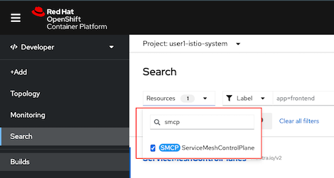
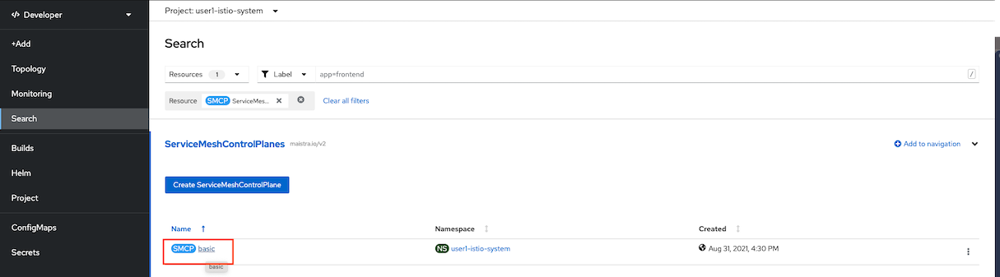
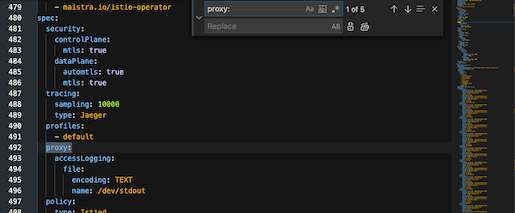
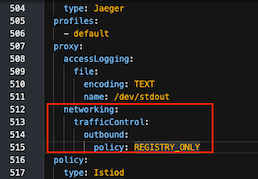
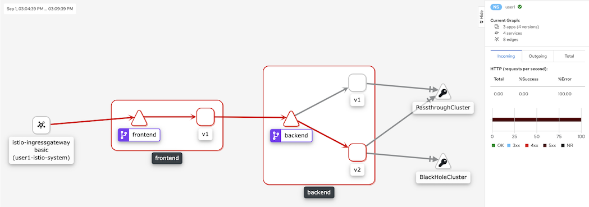
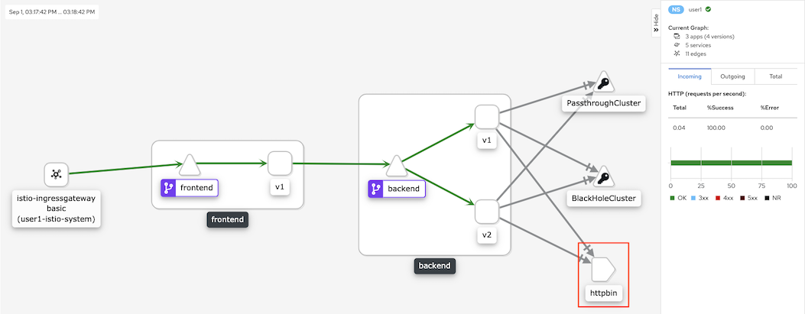

# Outbound Traffic Control

- [Outbound Traffic Control](#outbound-traffic-control)
  - [Setup](#setup)
    - [Deploy Frontend and Backend App](#deploy-frontend-and-backend-app)
    - [ALLOW_ANY or REGISTRY_ONLY](#allow_any-or-registry_only)
  - [Service Entry](#service-entry)
  - [Egress Gateway](#egress-gateway)
  - [Next Topic](#next-topic)
## Setup

### Deploy Frontend and Backend App 

  ```bash
  oc delete all --all -n $USERID
  oc delete dr,vs,gateway --all -n $USERID
  oc apply -f ocp/frontend-v1-deployment.yaml -n $USERID
  oc patch deployment frontend-v1 -p '{"spec":{"template":{"metadata":{"annotations":{"sidecar.istio.io/inject":"true"}}}}}' -n $USERID
  oc apply -f ocp/frontend-service.yaml -n $USERID
  oc apply -f ocp/backend-v1-deployment.yaml -n $USERID
  oc apply -f ocp/backend-v2-deployment.yaml -n $USERID
  oc apply -f ocp/backend-service.yaml -n $USERID
  cat istio-files/destination-rule-backend-v1-v2.yaml|sed s/USERID/$USERID/g|oc apply -n $USERID -f -
  cat istio-files/virtual-service-backend-v1-v2-50-50.yaml|sed s/USERID/$USERID/g|sed s/DOMAIN/$DOMAIN/g|oc apply -n $USERID -f -
  cat istio-files/destination-rule-frontend.yaml|sed s/USERID/$USERID/g|oc apply -n $USERID -f -
  cat istio-files/virtual-service-frontend-single-version.yaml|sed s/USERID/$USERID/g|sed s/DOMAIN/$DOMAIN/g|oc apply -n $USERID -f -
  DOMAIN=$(oc whoami --show-console | awk -F'apps.' '{print $2}')
  cat istio-files/gateway.yaml | sed s/USERID/$USERID/ | sed s/DOMAIN/$DOMAIN/ | oc apply -n $USERID -f -
  ```


### ALLOW_ANY or REGISTRY_ONLY

* By default Istio allow request go outside Service Mesh. This configuration is ServiceMeshControlPlane CRD in Control Plane project.

  - Use OpenShift Developer Console. Select project $USERID-istio-system navigate to Search -> Resources and input smcp

    

  - Select basic

    

  - Click YAML tab, Press Ctrl-F and input *"proxy: "*
     
    

  - Add network part of following YAML snippet
    Remark: Default value of policy is ALLOW_ANY that allow egress traffic to any destination. With REGISTRY_ONLY, all egress (outbound) traffic will be blocked by default.
    
    ```yaml
    proxy:
      accessLogging:
        file:
          encoding: TEXT
          name: /dev/stdout
      networking:
        trafficControl:
          outbound:
            policy: REGISTRY_ONLY
    ```

    Example of result

    

* Test with cURL
  
  ```bash
  GATEWAY_URL=$(oc get route $(oc get route -n $USERID-istio-system | grep frontend | awk '{print $1}') -n $USERID-istio-system -o yaml  -o jsonpath='{.spec.host}')
  curl -v $GATEWAY_URL
  ```

  Example of output with response code 503

  ```bash
  > GET / HTTP/1.1
  > Host: frontend-istio-user1.apps.cluster-f25e.f25e.sandbox1804.opentlc.com
  > User-Agent: curl/7.64.1
  > Accept: */*
  >
  < HTTP/1.1 503 Service Unavailable
  < x-correlation-id: 8a3beebc-28e7-4718-b7e3-71478662b133
  < x-powered-by: Express
  < content-type: text/html; charset=utf-8
  < content-length: 205
  < etag: W/"cd-t+3n5dcHmbAQl6iAmJhifHydx0w"
  < date: Wed, 01 Sep 2021 08:06:48 GMT
  < x-envoy-upstream-service-time: 327
  < server: istio-envoy
  < set-cookie: 8097191f7a5222ce5d42040bacdfc8bb=938ce0a632cb66b8428d037ceba1ea93; path=/; HttpOnly
  <
  * Connection #0 to host frontend-istio-user1.apps.cluster-f25e.f25e.sandbox1804.opentlc.com left intact
  Frontend version: 1.0.0 => [Backend: http://backend:8080, Response: 503, Body: Backend version:v2, Response:503, Host:backend-v2-5758c6c584-9tqcs, Status:503, Message: Remote host terminated the handshake]
  ```
* Check Kiali Graph

  

  Remark:
  - PassThroghCluster is virtual cluster created with ALLOW_ALL mode which passthrough all traffic.
  - BlackHoleCluster is virtual clustercreate with REGISTRY_ONLY mode which block all traffic.

## Service Entry

Create ServiceEntry to allow egress traffic to httpbin.org and allow only HTTPS and port 443. 

* Check for [Service Entry](../istio-files/service-entry-httpbin.yaml)

  ```yaml
  apiVersion: networking.istio.io/v1alpha3
  kind: ServiceEntry
  metadata:
    name: http.bin
  spec:
    hosts:
    - httpbin.org
    ports:
    - number: 443
      name: https
      protocol: HTTPS
    resolution: DNS
    location: MESH_EXTERNAL
  ```

* Create [Service Entry](../istio-files/service-entry-httpbin.yaml)
  
  ```bash
  oc apply -f istio-files/service-entry-httpbin.yaml -n $USERID
  ```
* test with cURL
  
  ```bash
  curl -v $GATEWAY_URL
  ```

  Example of output with 200 OK

  ```bash
  Frontend version: 1.0.0 => [Backend: http://backend:8080, Response: 200, Body: Backend version:v1, Response:200, Host:backend-v1-686579548c-g9w7z, Status:200, Message: Hello, Quarkus]
  ```
* Check Kiali Console
  
  

<!-- ## Clean Up
Reconfigure istio configmap back to ALLOW_ANY.
For OpenShift Service Mesh 1.x

```bash
 oc get configmap istio -n ${USERID}-istio-system -o yaml \
  | sed 's/mode: REGISTRY_ONLY/mode: ALLOW_ANY/g' \
  | oc replace -n ${USERID}-istio-system -f -
```

For OpenShift Service Mesh 2.x

```bash
 oc get configmap istio-basic-install -n ${USERID}-istio-system -o yaml \
  | sed 's/mode: REGISTRY_ONLY/mode: ALLOW_ANY/g' \
  | oc replace -n ${USERID}-istio-system -f -
```

Run oc delete command to remove Istio policy.
```bash
oc delete -f istio-files/egress-serviceentry.yml -n $USERID
``` -->
## Egress Gateway

## Next Topic

<!-- [Timeout](./07-timeout.md) -->