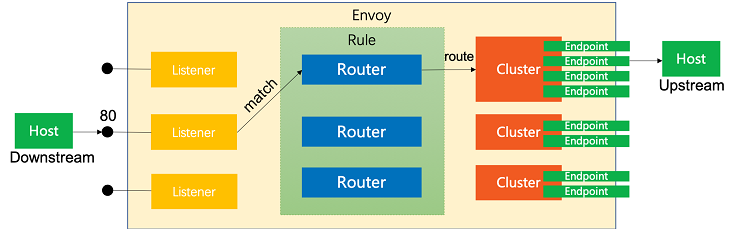

# Envoy

## Install istioctl

~~~bash
$ curl -sL https://istio.io/downloadIstioctl | sh -
$ export PATH=$HOME/.istioctl/bin:$PATH
~~~

## Check Listeners, Routes, Clusters and Endpoints

~~~bash
$ oc get pods
NAME                           READY   STATUS        RESTARTS   AGE
toolbox-945cc5468-crkp2        2/2     Running       0          5d2h

$ oc get svc
NAME      TYPE        CLUSTER-IP      EXTERNAL-IP   PORT(S)    AGE
toolbox   ClusterIP   172.30.10.192   <none>        8080/TCP   9h
~~~

~~~bash
$ istioctl proxy-config listeners toolbox-945cc5468-crkp2 --port 8080
ADDRESS PORT MATCH DESTINATION
0.0.0.0 8080 ALL   Route: 8080

$ istioctl proxy-config listeners toolbox-945cc5468-crkp2 --port 8080 -o yaml | grep routeConfigName
          routeConfigName: "8080"

# Log Format Setting
$ istioctl proxy-config listeners toolbox-945cc5468-crkp2 --port 8080 -o yaml
<Snip>
  - filters:
    - name: envoy.filters.network.http_connection_manager
      typedConfig:
        '@type': type.googleapis.com/envoy.extensions.filters.network.http_connection_manager.v3.HttpConnectionManager
        accessLog:
        - name: envoy.access_loggers.file
          typedConfig:
            '@type': type.googleapis.com/envoy.extensions.access_loggers.file.v3.FileAccessLog
            logFormat:
              textFormatSource:
                inlineString: |
                  [%START_TIME%] "%REQ(:METHOD)% %REQ(X-ENVOY-ORIGINAL-PATH?:PATH)% %PROTOCOL%" %RESPONSE_CODE% %RESPONSE_FLAGS% %RESPONSE_CODE_DETAILS% %CONNECTION_TERMINATION_DETAILS% "%UPSTREAM_TRANSPORT_FAILURE_REASON%" %BYTES_RECEIVED% %BYTES_SENT% %DURATION% %RESP(X-ENVOY-UPSTREAM-SERVICE-TIME)% "%REQ(X-FORWARDED-FOR)%" "%REQ(USER-AGENT)%" "%REQ(X-REQUEST-ID)%" "%REQ(:AUTHORITY)%" "%UPSTREAM_HOST%" %UPSTREAM_CLUSTER% %UPSTREAM_LOCAL_ADDRESS% %DOWNSTREAM_LOCAL_ADDRESS% %DOWNSTREAM_REMOTE_ADDRESS% %REQUESTED_SERVER_NAME% %ROUTE_NAME%
            path: /dev/stdout
<Snip>
~~~

~~~bash
$ istioctl proxy-config route toolbox-945cc5468-crkp2 --name 8080
NAME     DOMAINS                                            MATCH     VIRTUAL SERVICE
8080     toolbox, toolbox.test-istio-egress + 1 more...     /*

$ istioctl proxy-config route toolbox-945cc5468-crkp2 --name 8080 -o yaml
- name: "8080"
  validateClusters: false
  virtualHosts:
  - domains:
    - '*'
    includeRequestAttemptCount: true
    name: allow_any
    routes:
    - match:
        prefix: /
      name: allow_any
      route:
        cluster: PassthroughCluster #<=== PassthroughCluster
        maxGrpcTimeout: 0s
        timeout: 0s
  - domains:
    - toolbox.test-istio-egress.svc.cluster.local
    - toolbox.test-istio-egress.svc.cluster.local:8080
    - toolbox
    - toolbox:8080
    - toolbox.test-istio-egress.svc
    - toolbox.test-istio-egress.svc:8080
    - toolbox.test-istio-egress
    - toolbox.test-istio-egress:8080
    - 172.30.10.192
    - 172.30.10.192:8080
    includeRequestAttemptCount: true
    name: toolbox.test-istio-egress.svc.cluster.local:8080
    routes:
    - decorator:
        operation: toolbox.test-istio-egress.svc.cluster.local:8080/*
      match:
        prefix: /
      name: default
      route:
        cluster: outbound|8080||toolbox. test-istio-egress.svc.cluster.local # <== cluster Name
        maxStreamDuration:
          grpcTimeoutHeaderMax: 0s
          maxStreamDuration: 0s
        retryPolicy:
        <Snip>
        timeout: 0s
~~~

~~~bash
$ istioctl proxy-config cluster toolbox-945cc5468-crkp2 --fqdn toolbox.test-istio-egress.svc.cluster.local
SERVICE FQDN                                    PORT     SUBSET     DIRECTION     TYPE     DESTINATION RULE
toolbox.test-istio-egress.svc.cluster.local     8080     -          outbound      EDS
~~~

~~~bash
$ istioctl proxy-config endpoint toolbox-945cc5468-crkp2 --cluster 'outbound|8080||toolbox.test-istio-egress.svc.cluster.local' -o yaml
- addedViaApi: true
  circuitBreakers:
    thresholds:
    - maxConnections: 4294967295
      maxPendingRequests: 4294967295
      maxRequests: 4294967295
      maxRetries: 4294967295
    - maxConnections: 1024
      maxPendingRequests: 1024
      maxRequests: 1024
      maxRetries: 3
      priority: HIGH
  hostStatuses:
  - address:
      socketAddress:
        address: 10.128.1.76 # <==== Pod IP
        portValue: 8080
    healthStatus:
      edsHealthStatus: HEALTHY
~~~

## Envoy Access Log

~~~bash

$ oc rsh toolbox-945cc5468-crkp2 curl quay-server.nancyge.com:8080

$ oc logs toolbox-945cc5468-crkp2 -c istio-proxy -f
# Pay attention to cluster=PasssthrouCluster, route=allow_any
[2022-09-20T03:17:07.037Z] "GET / HTTP/1.1" 403 - via_upstream - "-" 0 4927 11 11 "-" "curl/7.61.1" "94be30bc-2100-9bcb-bbf8-17f41c4b5368" "quay-server.nancyge.com:8080" "10.72.94.119:8080" PassthroughCluster 10.128.1.76:45864 10.72.94.119:8080 10.128.1.76:45854 - allow_any
~~~
