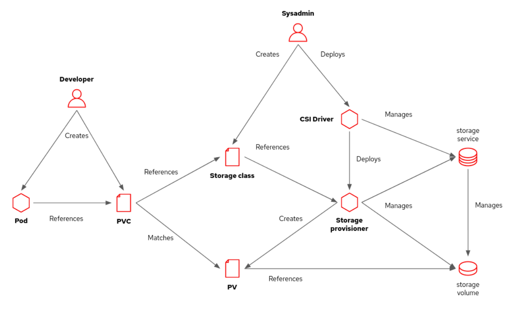

# NFS

## How to use NFS StorageClass in OCP4

<https://two-oes.medium.com/working-with-nfs-as-a-storageclass-in-openshift-4-44367576771c>

<https://github.com/kubernetes-sigs/nfs-subdir-external-provisioner>

<https://www.ibm.com/support/pages/how-do-i-create-storage-class-nfs-dynamic-storage-provisioning-openshift-environment>

### Change rbac.yaml

~~~bash
$ git clone https://github.com/kubernetes-sigs/nfs-subdir-external-provisioner.git

$ oc create namespace openshift-nfs-storage

# And we would want the cluster to monitor the Operator so we will add the label to the namespace :

$ oc label namespace openshift-nfs-storage "openshift.io/cluster-monitoring=true"
$ oc project openshift-nfs-storage

# Next we will update the deployment and the RBAC accordingly:
$ cd nfs-subdir-external-provisioner
$ NAMESPACE=`oc project -q`
$ sed -i'' "s/namespace:.*/namespace: $NAMESPACE/g" ./deploy/rbac.yaml
$ sed -i'' "s/namespace:.*/namespace: $NAMESPACE/g" ./deploy/deployment.yaml

$ oc create -f deploy/rbac.yaml

# and we need to update the service account with the right permissions:
$ oc adm policy add-scc-to-user hostmount-anyuid system:serviceaccount:$NAMESPACE:nfs-client-provisioner
~~~

### Change deployment.yaml

* from

~~~yaml
          env:
            - name: PROVISIONER_NAME
              value: k8s-sigs.io/nfs-subdir-external-provisioner
            - name: NFS_SERVER
              value: 10.3.243.101
            - name: NFS_PATH
              value: /ifs/kubernetes
      volumes:
        - name: nfs-client-root
          nfs:
            server: 10.3.243.101
            path: /ifs/kubernetes
~~~

* to:

~~~yaml
          env:
            - name: PROVISIONER_NAME
              value: k8s-sigs.io/nfs-subdir-external-provisioner
            - name: NFS_SERVER
              value: 10.72.94.119
            - name: NFS_PATH
              value: /var/nfsshare
      volumes:
        - name: nfs-client-root
          nfs:
            server: 10.72.94.119
            path: /var/nfsshare
~~~

### class.yaml

~~~ bash
$ cat > deploy/class.yaml << EOF
apiVersion: storage.k8s.io/v1
kind: StorageClass
metadata:
  name: nfs-client
provisioner: k8s-sigs.io/nfs-subdir-external-provisioner # or choose another name, must match deployment's env PROVISIONER_NAME'
volumeBindingMode: Immediate
parameters:
  archiveOnDelete: "false"
EOF
~~~

### Create class and deployment

~~~ bash
$ oc create -f deploy/class.yaml
$ oc create -f deploy/deployment.yaml

$ oc get pods
NAME                                     READY   STATUS      RESTARTS   AGE
nfs-client-provisioner-8bdd474bb-6gl8c   1/1     Running     0          18m
~~~

### Test

~~~bash
$ oc create -f deploy/test-claim.yaml -f deploy/test-pod.yaml

# In NFS Server:

$ pwd
/var/nfsshare/openshift-nfs-storage-test-claim-pvc-26721077-7c63-41c3-8264-9a5455073822
$ ls
SUCCESS
~~~

### Mark the NFS storage class as default

~~~ bash
$ oc patch storageclass nfs-client -p '{"metadata": {"annotations": {"storageclass.kubernetes.io/is-default-class": "true"}}}'
~~~

### Troubleshooting

*1. If PVC remains in Pending, need to check `nfs-client-provisioner` pod logs.
*2. Existing issue <https://github.com/kubernetes-sigs/nfs-subdir-external-provisioner/issues/25> and this is why we need to replace <quay.io/external_storage/nfs-client-provisioner:latest> with <gcr.io/k8s-staging-sig-storage/nfs-subdir-external-provisioner:v4.0.2>.
