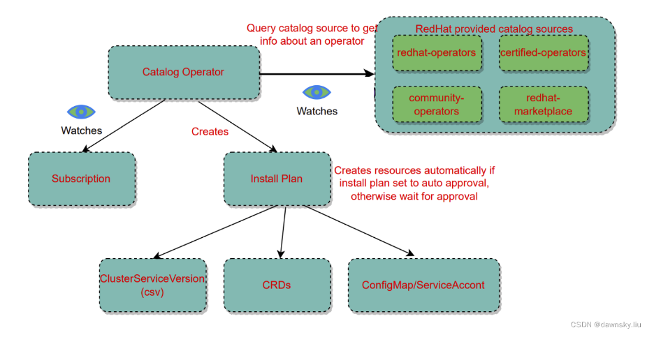

# OLM

## Architecture



## Installation Process of an Operator

1. The User creates `Subscription` object, which represents the "intent" to install an Operator
2. `catalog-operator` watches `subcription` object through informers, and call the relevant event handler if new subscription is created
3. The `catalog-operator` creates a job under `openshift-marketplace`, in which the job will pull the operator bundle image (through its init-container) to the cluster and create a `configMap` which contains the manifest yamls in `openshift-marketplace`.

   ```bash
   $ oc get pods -n openshift-marketplace 9d79bcc45684cb328688eb1a4865084d39ea5149330c6db5fada94e974vnnkc -o yaml

   spec:
    containers:
    - command:
        - opm
        - alpha
        - bundle
        - extract
        - -m
        - /bundle/
        - -n
        - openshift-marketplace
        - -c  // -c means to create a configMap to hold the extracted yamls
        - 9d79bcc45684cb328688eb1a4865084d39ea5149330c6db5fada94e974c4905
        - -z
        env:
        - name: CONTAINER_IMAGE
        value: registry.redhat.io/edo/external-dns-operator-bundle@sha256:a614ec94c2468e34e129e9ecd4bc0d1895eb67b96e77eb5ad94cd8bd507860f5
        image: quay.io/openshift-release-dev/ocp-v4.0-art-dev@sha256:d02ae8b907c722c2afe6f733a94cac19911a89a61aa2ced709cb0fb685cebeba
   ```

4. The `catalog-operator` creates an `installPlan`, in which the `installPlan` will refer to the configMap content which is created in step 3

   ```bash
   $ oc get configMap -n openshift-marketplace 9d79bcc45684cb328688eb1a4865084d39ea5149330c6db5fada94e974c4905 -o yaml

   apiVersion: v1
   binaryData:
     external-dns-operator.clusterserviceversion.yaml: SDRzSUFBQUFBQUFBLyt5OGVZK3J5SklvL245L0NuUm1mdW83NHJyWXdTNzlXbnFzeGlzWTd4NWR0UkpJRnJOREFvWjU4OTJmN0ZwT1ZSMmY3blB1OW03UE8waWxzc25JeUlqSVdESWpJdzN5Y0FmTE

   $ oc get ip install-jhbbh -o yaml

     plan:
     - resolving: external-dns-operator.v1.2.0
       resource:
         group: operators.coreos.com
         kind: ClusterServiceVersion
         manifest: '{"kind":"ConfigMap","name":"9d79bcc45684cb328688eb1a4865084d39ea5149330c6db5fada94e974c4905","namespace":"openshift-marketplace","catal
   ogSourceName":"redhat-operators","catalogSourceNamespace":"openshift-marketplace","replaces":"","properties":"{\"properties\":[{\"type\":\"olm.gvk\",\"v
   alue\":{\"group\":\"externaldns.olm.openshift.io\",\"kind\":\"ExternalDNS\",\"version\":\"v1alpha1\"}},{\"type\":\"olm.gvk\",\"value\":{\"group\":\"exte
   rnaldns.olm.openshift.io\",\"kind\":\"ExternalDNS\",\"version\":\"v1beta1\"}},{\"type\":\"olm.package\",\"value\":{\"packageName\":\"external-dns-operat
   or\",\"version\":\"1.2.0\"}}]}"}'
         name: external-dns-operator.v1.2.0
         sourceName: redhat-operators
         sourceNamespace: openshift-marketplace
         version: v1alpha1
       status: Present

   ```

5. Once the `installPlan` is approved, the CSV yaml will be created by `installPlan`, along with other yamls such as `RoleBinding`, `CRDs` etc. Among these, `olm-operator` will consume the CSV to create the actual deployment object of the operator from CSV yaml.

   ```bash
   $ oc get csv external-dns-operator.v1.2.0 -o yaml

        deployments:
        - name: external-dns-operator
            spec:
            replicas: 1
            selector:
                matchLabels:
                name: external-dns-operator
            strategy:
                rollingUpdate:
                maxUnavailable: 25%
                type: RollingUpdate
            template:
                metadata:
                creationTimestamp: null
                labels:
                    name: external-dns-operator
                spec:
                containers:
                - args:
                    - --metrics-bind-address=127.0.0.1:8080
                    - --operator-namespace=$(OPERATOR_NAMESPACE)
                    - --operand-namespace=$(OPERATOR_NAMESPACE)
                    - --externaldns-image=$(RELATED_IMAGE_EXTERNAL_DNS)
                    - --trusted-ca-configmap=$(TRUSTED_CA_CONFIGMAP_NAME)
                    - --leader-elect
                    - --webhook-disable-http2
   ```

6. To summarize, `catalog-operator` watches `subscription`, creates (and reconciles) `installPlan`. `installPlan` creates CSV yaml and `olm-operator` consumes CSV yaml to create the actual operator deployment.
